Cluster Analysis on Employee Attrition Data
================

### Introduction

This analysis looked at the fictional dataset IBM HR Analytics Employee Attrition and Performance, which was found on Kaggle at:

<https://www.kaggle.com/pavansubhasht/ibm-hr-analytics-attrition-dataset>

The goal was to use this dataset to discover insights into what types of employees were more likely to leave the company through clustering analysis. If a company could successfully do this, it could enable them to identify certain groups that are at a higher risk and take proactive steps to help reduce turnover. Since there are many costs associated with employee turnover, this type of analysis could be very profitable by helping to reduce these costs.

### The Data

The dataset consisted of 35 variables for 1,470 employees. A list and brief description (if necessary) of each variable is included below:

Age

Attrition - whether or not the employee left the company (Yes/No)

BusinessTravel - how often the employee travels (None/Frequently/Rarely)

DailyRate - amount of money paid per day

Department (Human Resources/Research & Development/Sales)

DistanceFromHome

Education - (1:Below College, 2:College, 3:Bachelor, 4:Master, 5:Doctor)

EducationField

EmployeeCount - all employees have count of 1

EmployeeNumber - employee's ID number

EnvironmentSatisfaction - satisfaction with work environment (1-4)

Gender (Male/Female)

HourlyRate - amount of money paid per hour

JobInvolvement - how involved employee is with job (1-4)

JobLevel (1-5)

JobRole

JobSatisfaction - satisfaction with job (1-4)

MaritalStatus (Single/Married/Divorced)

MonthlyIncome

MonthlyRate - amount of money paid per month

NumCompaniesWorked - number of companies worked for in career

Over18 - if employee is over 18 (all are Yes)

OverTime - if employee works overtime (Yes/No)

PercentSalaryHike - the percent change in salary from 2015 to 2016

PerformanceRating - rating for job performance (3 or 4)

RelationshipSatisfaction - how happy employee is with colleagues (1-4)

StandardHours - number of standard hours worked over 2 weeks (all are 80)

StockOptionLevel - how much in company's stock options owned (0-3)

TotalWorkingYears - number of years employee has worked

TrainingTimesLastYear - how many times employee was trained last year

WorkLifeBalance (1-4)

YearsAtCompany - number of years worked at company

YearsInCurrentRole - number of years in current job role

YearsSinceLastPromotion - number of years since last promotion

YearsWithCurrManager - number of years with current manager

Part 1 - Clustering By All Employees
------------------------------------

### Approach

The approach to this problem was to use clustering analysis to determine the types of employees who might be more likely to leave the company. One immediate observation with 35 variables was that using some type of dimension reduction technique - such as principal components analysis (PCA) - might be beneficial to reduce the number of variables.

However, before proceeding, it was important to investigate the different data types in the dataset.

``` r
str(employees)
```

    ## 'data.frame':    1470 obs. of  35 variables:
    ##  $ Age                     : int  41 49 37 33 27 32 59 30 38 36 ...
    ##  $ Attrition               : Factor w/ 2 levels "No","Yes": 2 1 2 1 1 1 1 1 1 1 ...
    ##  $ BusinessTravel          : Factor w/ 3 levels "Non-Travel","Travel_Frequently",..: 3 2 3 2 3 2 3 3 2 3 ...
    ##  $ DailyRate               : int  1102 279 1373 1392 591 1005 1324 1358 216 1299 ...
    ##  $ Department              : Factor w/ 3 levels "Human Resources",..: 3 2 2 2 2 2 2 2 2 2 ...
    ##  $ DistanceFromHome        : int  1 8 2 3 2 2 3 24 23 27 ...
    ##  $ Education               : int  2 1 2 4 1 2 3 1 3 3 ...
    ##  $ EducationField          : Factor w/ 6 levels "Human Resources",..: 2 2 5 2 4 2 4 2 2 4 ...
    ##  $ EmployeeCount           : int  1 1 1 1 1 1 1 1 1 1 ...
    ##  $ EmployeeNumber          : int  1 2 4 5 7 8 10 11 12 13 ...
    ##  $ EnvironmentSatisfaction : int  2 3 4 4 1 4 3 4 4 3 ...
    ##  $ Gender                  : Factor w/ 2 levels "Female","Male": 1 2 2 1 2 2 1 2 2 2 ...
    ##  $ HourlyRate              : int  94 61 92 56 40 79 81 67 44 94 ...
    ##  $ JobInvolvement          : int  3 2 2 3 3 3 4 3 2 3 ...
    ##  $ JobLevel                : int  2 2 1 1 1 1 1 1 3 2 ...
    ##  $ JobRole                 : Factor w/ 9 levels "Healthcare Representative",..: 8 7 3 7 3 3 3 3 5 1 ...
    ##  $ JobSatisfaction         : int  4 2 3 3 2 4 1 3 3 3 ...
    ##  $ MaritalStatus           : Factor w/ 3 levels "Divorced","Married",..: 3 2 3 2 2 3 2 1 3 2 ...
    ##  $ MonthlyIncome           : int  5993 5130 2090 2909 3468 3068 2670 2693 9526 5237 ...
    ##  $ MonthlyRate             : int  19479 24907 2396 23159 16632 11864 9964 13335 8787 16577 ...
    ##  $ NumCompaniesWorked      : int  8 1 6 1 9 0 4 1 0 6 ...
    ##  $ Over18                  : Factor w/ 1 level "Y": 1 1 1 1 1 1 1 1 1 1 ...
    ##  $ OverTime                : Factor w/ 2 levels "No","Yes": 2 1 2 2 1 1 2 1 1 1 ...
    ##  $ PercentSalaryHike       : int  11 23 15 11 12 13 20 22 21 13 ...
    ##  $ PerformanceRating       : int  3 4 3 3 3 3 4 4 4 3 ...
    ##  $ RelationshipSatisfaction: int  1 4 2 3 4 3 1 2 2 2 ...
    ##  $ StandardHours           : int  80 80 80 80 80 80 80 80 80 80 ...
    ##  $ StockOptionLevel        : int  0 1 0 0 1 0 3 1 0 2 ...
    ##  $ TotalWorkingYears       : int  8 10 7 8 6 8 12 1 10 17 ...
    ##  $ TrainingTimesLastYear   : int  0 3 3 3 3 2 3 2 2 3 ...
    ##  $ WorkLifeBalance         : int  1 3 3 3 3 2 2 3 3 2 ...
    ##  $ YearsAtCompany          : int  6 10 0 8 2 7 1 1 9 7 ...
    ##  $ YearsInCurrentRole      : int  4 7 0 7 2 7 0 0 7 7 ...
    ##  $ YearsSinceLastPromotion : int  0 1 0 3 2 3 0 0 1 7 ...
    ##  $ YearsWithCurrManager    : int  5 7 0 0 2 6 0 0 8 7 ...

You can quickly observe that both numeric (26) and categorical variables (9) are included, and that this would be an important fact in driving the types of techniques used for this analysis. Neither k-means nor hierarchical clustering are well-suited for categorical variables, so the decision was made to use partitioning around medoids (PAM) in conjunction with the Gower distance metric, which are better techniques to use for clustering on mixed data.

As a first pass, PCA was not applied, which minimized the amount of cleaning that needed to be performed before the Gower distance was calculated and the PAM algorithm was applied.

### Cleaning Data for PAM - Without PCA

Even though the categorical variables were essentially left alone, the numeric variables needed to be scaled since they were all on different scales. Therefore, if a variable was numeric, the 'scale' function was applied. Otherwise, the factor variables were retained in their current formats.

``` r
employees_scaled <- cbind(employees[,-which(names(employees) %in%  names(employees)[sapply(employees, is.numeric)])], scale(employees[,names(employees)[sapply(employees, is.numeric)]]))
```

After reviewing all of the variables, it become apparent that several would not be needed for the analysis. The variables Over 18 ('Y'), Employee Count (1), and Standard Hours (80) contained the same values for every employee in the file, so no new information would be added by including them. EmployeeNumber was also removed, because this was the employee's ID number, which also adds no value to the analysis.

``` r
employees_scaled$Over18 <- NULL
employees_scaled$EmployeeCount <- NULL
employees_scaled$StandardHours <- NULL
employees_scaled$EmployeeNumber <- NULL
```

### PAM Clustering with Gower Distance on Entire Dataset - Without PCA

At this point, the data was in the appropriate format to calculate the Gower distance and apply the PAM clustering algorithm. The Gower distance was calculated with the 'daisy' function and then used as the input to the 'pam' function.

Another important part of this process was to determine the optimal number of clusters to use. In order to do this, the Silhouette coefficient was used to determine which value of k (2-8) had the highest value. The results were then plotted for easy visualization.

``` r
gower_dist <- daisy(employees_scaled, metric = "gower")

sil_width <- c(NA)
for(i in 2:8){  
  pam_fit <- pam(gower_dist, diss = TRUE, k = i)  
  sil_width[i] <- pam_fit$silinfo$avg.width  
}
plot(1:8, sil_width,
     xlab = "Number of clusters",
     ylab = "Silhouette Width")
lines(1:8, sil_width)
```

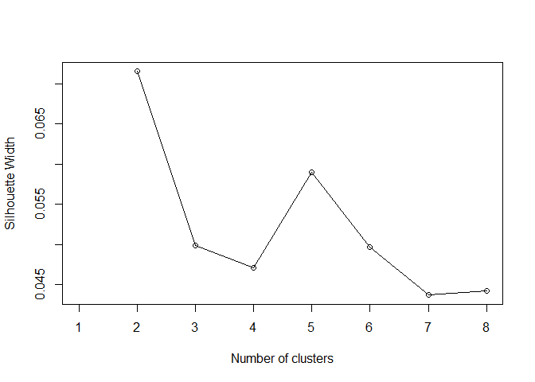

You can see from the plot that 2 clusters would be the optimal number to use. Therefore, the fit was created with k=2 so that summary statistics could be calculated for each cluster. The cluster results were also appended to the original employees dataset in order to dig deeper into the results.

``` r
k <- 2
pam_fit <- pam(gower_dist, diss = TRUE, k)

pam_results <- employees %>%
  mutate(cluster = pam_fit$clustering) %>%
  group_by(cluster) %>%
  do(the_summary = summary(.))

employees <- cbind(employees, pam_fit$clustering)
```

The first check was to see how many employees ended up in each cluster. As you can see from the table breakdown, they are fairly balanced.

``` r
table(pam_fit$clustering)
```

    ## 
    ##   1   2 
    ## 676 794

You can view the complete summary for every variable by looking at the summary generated above('pam\_results$the\_summary'), but there are a couple of key differences that stand out between the clusters.

The first thing observed is that one cluster has a higher than average attrition rate, while the other cluster is lower than average.

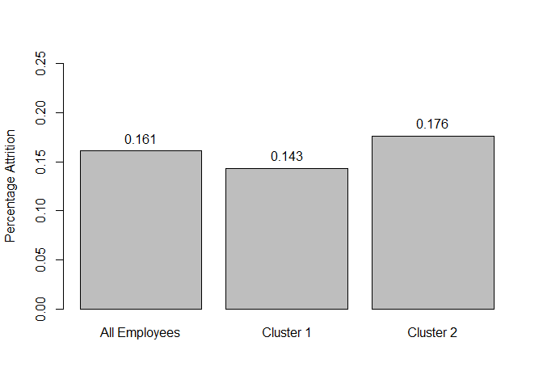

In the cluster with higher attrition, you can see that the age is slightly lower, pay is lower, these employees have fewer years at company, fewer overall working years, and lower job levels. These factors all point to employees who are less tenured and younger in their careers than the cluster with less attrition.

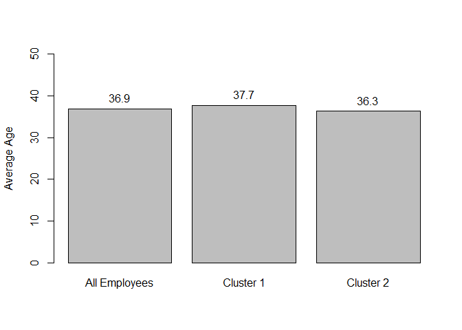

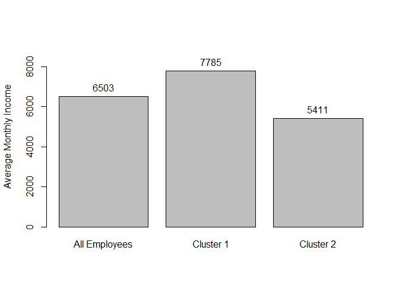

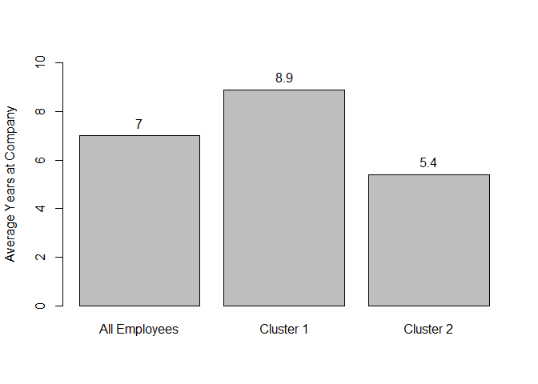

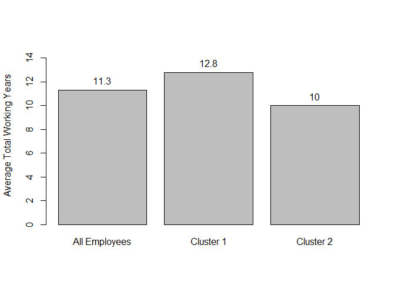

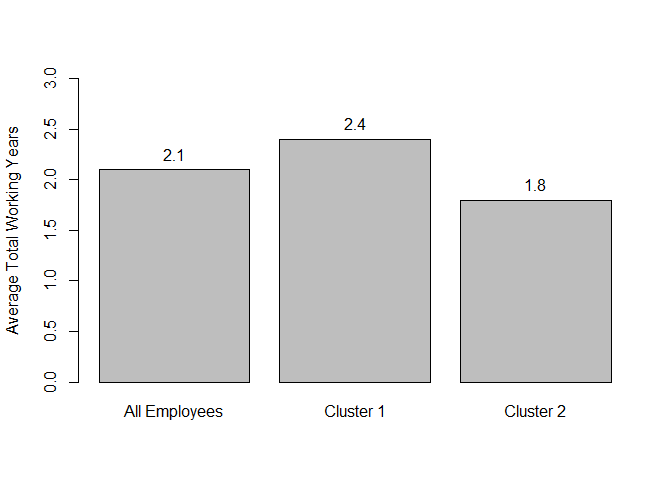

While it makes sense that these younger, less tenured employees would be prone to higher rates of turnover, since they have less invested with the company over a longer period of time, there is another significant difference between the two clusters that could indicate something else going on.

If you look at the differences in job roles/departments between the two groups, they are significant and seem to have broken out along these lines.

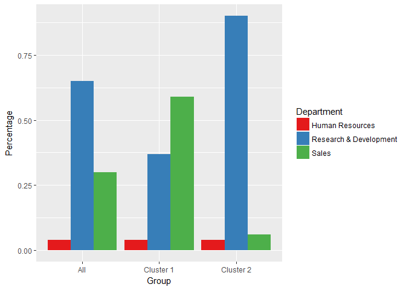

The cluster with higher attrition is made up almost entirely of jobs in the Research & Development Department, while the other cluster consists of a majority of Sales jobs. This is an important insight that we will explore further in the analysis.

### Cleaning Data for PAM - With PCA

Earlier in the post, it was mentioned that the first cluster analysis did not perform PCA before PAM. However, in order to compare the results between the two approaches, we will now begin the analysis again - except this time by applying PCA first.

With so many categorical variables, it could prove challenging to perform PCA - which is typically best for numerical predictors, but we will still convert the categorical variables to binary variables to see how the results compare to the analysis with no PCA. The same variables that were removed before (Over18, EmployeeCount, StandardHours, EmployeeNumber) were removed again, and we were left with the following transformed data set:

``` r
str(employees_PCA)
```

    ## 'data.frame':    1470 obs. of  50 variables:
    ##  $ Age                          : int  41 49 37 33 27 32 59 30 38 36 ...
    ##  $ Attrition                    : num  1 0 1 0 0 0 0 0 0 0 ...
    ##  $ DailyRate                    : int  1102 279 1373 1392 591 1005 1324 1358 216 1299 ...
    ##  $ DistanceFromHome             : int  1 8 2 3 2 2 3 24 23 27 ...
    ##  $ Education                    : int  2 1 2 4 1 2 3 1 3 3 ...
    ##  $ EnvironmentSatisfaction      : int  2 3 4 4 1 4 3 4 4 3 ...
    ##  $ Gender                       : num  0 1 1 0 1 1 0 1 1 1 ...
    ##  $ HourlyRate                   : int  94 61 92 56 40 79 81 67 44 94 ...
    ##  $ JobInvolvement               : int  3 2 2 3 3 3 4 3 2 3 ...
    ##  $ JobLevel                     : int  2 2 1 1 1 1 1 1 3 2 ...
    ##  $ JobSatisfaction              : int  4 2 3 3 2 4 1 3 3 3 ...
    ##  $ MonthlyIncome                : int  5993 5130 2090 2909 3468 3068 2670 2693 9526 5237 ...
    ##  $ MonthlyRate                  : int  19479 24907 2396 23159 16632 11864 9964 13335 8787 16577 ...
    ##  $ NumCompaniesWorked           : int  8 1 6 1 9 0 4 1 0 6 ...
    ##  $ OverTime                     : num  1 0 1 1 0 0 1 0 0 0 ...
    ##  $ PercentSalaryHike            : int  11 23 15 11 12 13 20 22 21 13 ...
    ##  $ PerformanceRating            : int  3 4 3 3 3 3 4 4 4 3 ...
    ##  $ RelationshipSatisfaction     : int  1 4 2 3 4 3 1 2 2 2 ...
    ##  $ StockOptionLevel             : int  0 1 0 0 1 0 3 1 0 2 ...
    ##  $ TotalWorkingYears            : int  8 10 7 8 6 8 12 1 10 17 ...
    ##  $ TrainingTimesLastYear        : int  0 3 3 3 3 2 3 2 2 3 ...
    ##  $ WorkLifeBalance              : int  1 3 3 3 3 2 2 3 3 2 ...
    ##  $ YearsAtCompany               : int  6 10 0 8 2 7 1 1 9 7 ...
    ##  $ YearsInCurrentRole           : int  4 7 0 7 2 7 0 0 7 7 ...
    ##  $ YearsSinceLastPromotion      : int  0 1 0 3 2 3 0 0 1 7 ...
    ##  $ YearsWithCurrManager         : int  5 7 0 0 2 6 0 0 8 7 ...
    ##  $ Travel_Rarely                : int  1 0 1 0 1 0 1 1 0 1 ...
    ##  $ Travel_Frequently            : int  0 1 0 1 0 1 0 0 1 0 ...
    ##  $ Non_Travel                   : int  0 0 0 0 0 0 0 0 0 0 ...
    ##  $ Dept_Sales                   : int  1 0 0 0 0 0 0 0 0 0 ...
    ##  $ Dept_Research_Development    : int  0 1 1 1 1 1 1 1 1 1 ...
    ##  $ Dept_Human_Resouces          : int  0 0 0 0 0 0 0 0 0 0 ...
    ##  $ Edu_Life_Sciences            : int  1 1 0 1 0 1 0 1 1 0 ...
    ##  $ Edu_Other                    : int  0 0 1 0 0 0 0 0 0 0 ...
    ##  $ Edu_Medical                  : int  0 0 0 0 1 0 1 0 0 1 ...
    ##  $ Edu_Marketing                : int  0 0 0 0 0 0 0 0 0 0 ...
    ##  $ Edu_Technical_Degree         : int  0 0 0 0 0 0 0 0 0 0 ...
    ##  $ Edu_Human_Resources          : int  0 0 0 0 0 0 0 0 0 0 ...
    ##  $ Job_Sales_Executive          : int  1 0 0 0 0 0 0 0 0 0 ...
    ##  $ Job_Research_Scientist       : int  0 1 0 1 0 0 0 0 0 0 ...
    ##  $ Job_Laboratory_Technician    : int  0 0 1 0 1 1 1 1 0 0 ...
    ##  $ Job_Manufacturing_Director   : int  0 0 0 0 0 0 0 0 1 0 ...
    ##  $ Job_Healthcare_Representative: int  0 0 0 0 0 0 0 0 0 1 ...
    ##  $ Job_Manager                  : int  0 0 0 0 0 0 0 0 0 0 ...
    ##  $ Job_Sales_Representative     : int  0 0 0 0 0 0 0 0 0 0 ...
    ##  $ Job_Research_Director        : int  0 0 0 0 0 0 0 0 0 0 ...
    ##  $ Job_Human_Resources          : int  0 0 0 0 0 0 0 0 0 0 ...
    ##  $ Single                       : int  1 0 1 0 0 1 0 0 1 0 ...
    ##  $ Married                      : int  0 1 0 1 1 0 1 0 0 1 ...
    ##  $ Divorced                     : int  0 0 0 0 0 0 0 1 0 0 ...

With all variables successfully converted to a numeric format, PCA was ready to be applied.

### Principal Components Analysis

Like before, the first step was to scale the data, since the predictors were on various scales. Once this was done, PCA was performed via the 'princomp' function.

``` r
employees_PCA <- scale(employees_PCA)

PCA_fit <- princomp(employees_PCA)
employees_PCA <- PCA_fit$scores
```

The results were then viewed to determine the proportion of variance that each component contributes to the overall total.

``` r
summary(PCA_fit)
```

    ## Importance of components:
    ##                           Comp.1     Comp.2     Comp.3     Comp.4
    ## Standard deviation     2.3219542 1.87716810 1.61954241 1.46296871
    ## Proportion of Variance 0.1079028 0.07052318 0.05249406 0.04283469
    ## Cumulative Proportion  0.1079028 0.17842601 0.23092007 0.27375476
    ##                            Comp.5     Comp.6     Comp.7     Comp.8
    ## Standard deviation     1.42006078 1.35070505 1.33715025 1.26952150
    ## Proportion of Variance 0.04035891 0.03651292 0.03578376 0.03225564
    ## Cumulative Proportion  0.31411367 0.35062659 0.38641035 0.41866599
    ##                            Comp.9    Comp.10   Comp.11    Comp.12
    ## Standard deviation     1.23481359 1.16660821 1.1540097 1.13993475
    ## Proportion of Variance 0.03051605 0.02723802 0.0266529 0.02600672
    ## Cumulative Proportion  0.44918204 0.47642006 0.5030730 0.52907968
    ##                           Comp.13    Comp.14    Comp.15   Comp.16
    ## Standard deviation     1.10518431 1.09445905 1.08173010 1.0776894
    ## Proportion of Variance 0.02444528 0.02397312 0.02341873 0.0232441
    ## Cumulative Proportion  0.55352495 0.57749808 0.60091681 0.6241609
    ##                           Comp.17    Comp.18    Comp.19    Comp.20
    ## Standard deviation     1.06433047 1.05960506 1.02564676 1.01779274
    ## Proportion of Variance 0.02267141 0.02247054 0.02105335 0.02073214
    ## Cumulative Proportion  0.64683232 0.66930286 0.69035621 0.71108835
    ##                           Comp.21    Comp.22    Comp.23    Comp.24
    ## Standard deviation     1.00983071 0.99719399 0.99509535 0.98059566
    ## Proportion of Variance 0.02040904 0.01990146 0.01981778 0.01924445
    ## Cumulative Proportion  0.73149740 0.75139886 0.77121663 0.79046108
    ##                           Comp.25    Comp.26    Comp.27    Comp.28
    ## Standard deviation     0.97464282 0.96361270 0.94337949 0.94033420
    ## Proportion of Variance 0.01901151 0.01858363 0.01781141 0.01769661
    ## Cumulative Proportion  0.80947259 0.82805622 0.84586763 0.86356424
    ##                           Comp.29    Comp.30    Comp.31    Comp.32
    ## Standard deviation     0.93315928 0.93072442 0.88987887 0.82855852
    ## Proportion of Variance 0.01742758 0.01733675 0.01584847 0.01373953
    ## Cumulative Proportion  0.88099182 0.89832857 0.91417704 0.92791657
    ##                           Comp.33    Comp.34     Comp.35     Comp.36
    ## Standard deviation     0.79202926 0.72055892 0.692119014 0.687873586
    ## Proportion of Variance 0.01255475 0.01039117 0.009587096 0.009469843
    ## Cumulative Proportion  0.94047132 0.95086249 0.960449587 0.969919431
    ##                            Comp.37     Comp.38     Comp.39     Comp.40
    ## Standard deviation     0.596761898 0.526700202 0.474760677 0.467545782
    ## Proportion of Variance 0.007127344 0.005552039 0.004511023 0.004374957
    ## Cumulative Proportion  0.977046774 0.982598813 0.987109836 0.991484793
    ##                           Comp.41     Comp.42     Comp.43     Comp.44
    ## Standard deviation     0.38471388 0.332986461 0.283646692 0.227025901
    ## Proportion of Variance 0.00296211 0.002219109 0.001610204 0.001031517
    ## Cumulative Proportion  0.99444690 0.996666013 0.998276217 0.999307734
    ##                             Comp.45                  Comp.46
    ## Standard deviation     0.1859831800 0.0000001568098961180514
    ## Proportion of Variance 0.0006922658 0.0000000000000004921216
    ## Cumulative Proportion  1.0000000000 0.9999999999999996669331
    ##                                         Comp.47                   Comp.48
    ## Standard deviation     0.0000000893084446125835 0.00000005557766338504507
    ## Proportion of Variance 0.0000000000000001596286 0.00000000000000006181959
    ## Cumulative Proportion  0.9999999999999997779554 0.99999999999999988897770
    ##                                          Comp.49
    ## Standard deviation     0.00000005196617088082924
    ## Proportion of Variance 0.00000000000000005404642
    ## Cumulative Proportion  0.99999999999999988897770
    ##                                           Comp.50
    ## Standard deviation     0.000000021594353240313790
    ## Proportion of Variance 0.000000000000000009332671
    ## Cumulative Proportion  1.000000000000000000000000

``` r
prop_var <- ((PCA_fit$sdev)^2)/sum((PCA_fit$sdev)^2)
plot(cumsum(prop_var), xlab = "Principal Component",
     ylab = "Cumulative Proportion of Variance", type = "b")
```

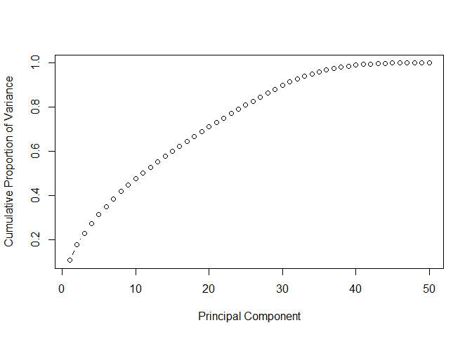

After viewing the summary values and the plot, it was determined to use the first 38 principal components. This amount captured over 98% of the variance, but reduced the number of variables from 50 to 38.

``` r
employees_PCA <- employees_PCA[1:1470, 1:38]
```

### PAM Clustering with Gower Distance on Entire Dataset - With PCA

Once the number of variables was reduced on the dataset, the same clustering method used previously, which utilized Gower distance with PAM was implemented to determine the ideal number of clusters.

``` r
gower_dist_PCA <- daisy(employees_PCA, metric = "gower")

sil_width <- c(NA)
for(i in 2:8){  
  pam_fit <- pam(gower_dist_PCA, diss = TRUE, k = i)  
  sil_width[i] <- pam_fit$silinfo$avg.width  
}
plot(1:8, sil_width,
     xlab = "Number of clusters",
     ylab = "Silhouette Width")
lines(1:8, sil_width)
```

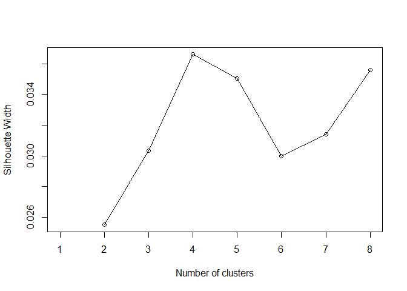

The Silhouette plot shows a peak at k=4, which is the value we will use.

``` r
k <- 4
pam_fit_PCA <- pam(gower_dist_PCA, diss = TRUE, k)

pam_results_PCA <- employees %>%
  mutate(cluster = pam_fit_PCA$clustering) %>%
  group_by(cluster) %>%
  do(the_summary = summary(.))

employees <- cbind(employees, pam_fit_PCA$clustering)
```

Once again, we start by checking the number of employees in each cluster to confirm that the distribution is reasonably balanced.

``` r
table(pam_fit_PCA$clustering)
```

    ## 
    ##   1   2   3   4 
    ## 321 527 425 197

Next, you can see that the attrition rates vary by cluster, with one being clearly above average, one being clearly below average, and the other two hovering around average.

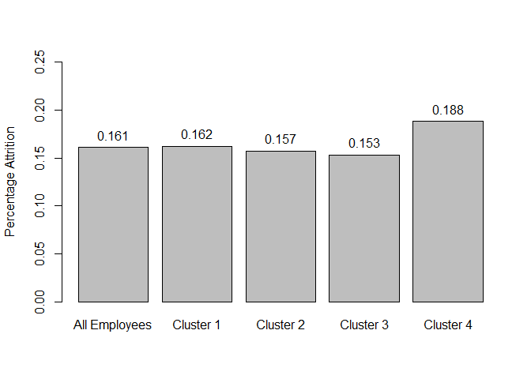

We then look at how each cluster differs along some of the same variables that we investigated in the first analysis to see if a similar picture begins to emerge.

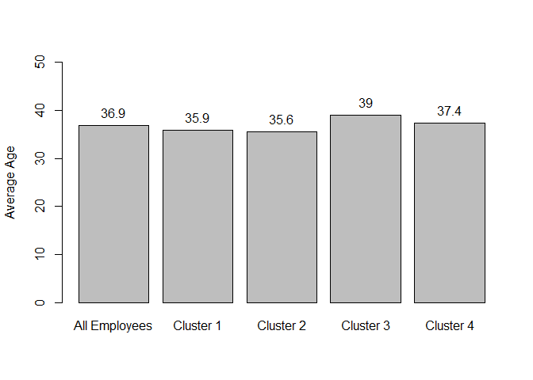

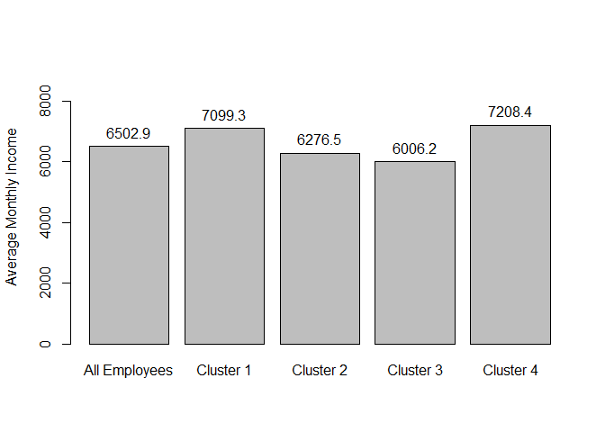

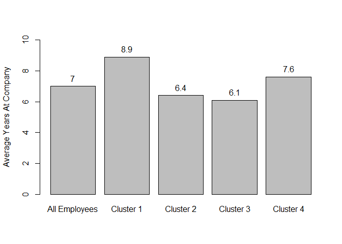

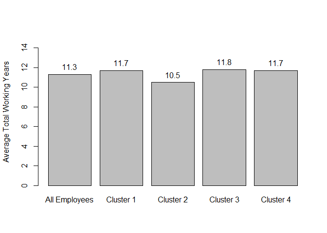

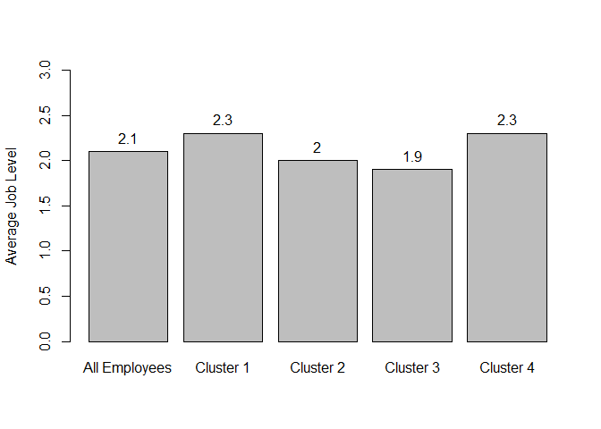

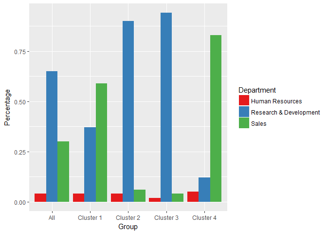

If you compare these plots to the plots generated from the cluster analysis with 2 clusters that did not use PCA, you can see that there is actually less variance between the clusters than previously seen. We will also run a quick test of cluster stability with the 'clusterboot' function to further test whether a smaller number of clusters is the preferred route to proceed.

### Check Cluster Stability

2 Clusters

``` r
cboot.pam2$bootmean
```

    ## [1] 0.6382063 0.5451880

``` r
cboot.pam2$bootbrd
```

    ## [1] 42 68

4 Clusters

``` r
cboot.pam4$bootmean
```

    ## [1] 0.6555361 0.5452531 0.6152888 0.5367098

``` r
cboot.pam4$bootbrd
```

    ## [1] 26 61 25 62

Checking the results from the stability tests confirms the idea that using a smaller number of clusters should be the preferred route going forward, since the clustering at k=2 dissolved a significantly fewer number of times than k=4.

However, one of the variables that displayed significant differences betwen the clusters was the employee's Job Department. This fact is an important indicator for where we should take the next steps of the analysis. If we break out the employee data into 3 different groups based on Department (Human Resources, Sales, and Research & Development), we could then use a smaller number of clusters on each to determine important differences between groups within a given department.

This approach has more practical implications too, since it would allow managers at the department-level to act more locally on these results, rather than just using the insights found from this analysis on a company-wide level. Plus, with jobs differing so much in responsibility and classification from one another, this is probably the more appropriate level of detail to do some preliminary grouping on job similarities. Then, other higher attrition characteristics can be found based on other variables, rather than the most obvious job department/role differences found above.

Part 2 - Clustering By Department
---------------------------------

We will build on the results we found in Part 1 by attempting to use a smaller number of clusters (for each department) and also by not applying PCA to the data. The results without PCA resulted in smaller, more stable clusters with more observable differences, so we will use that same approach again. It was worth a try to see the results of PCA, but as mentioned above, PCA is not ideally suited for categorical variables, so even after converting them to binary varialbes, it is probably not too surprising that the results did not seem as good. However, the Gower distance with PAM approach is suited for categorical and mixed data type variables, which helps explain why this method worked well.

### PAM Clustering with Gower Distance on Human Resources Department

``` r
employees_HR <- employees[employees$Department == 'Human Resources',]
employees_scaled_HR <- employees_scaled[employees_scaled$Department == 'Human Resources',]

gower_dist_HR <- daisy(employees_scaled_HR, metric = "gower")

sil_width <- c(NA)
for(i in 2:8){  
  pam_fit_HR <- pam(gower_dist_HR, diss = TRUE, k = i)  
  sil_width[i] <- pam_fit_HR$silinfo$avg.width  
}
plot(1:8, sil_width,
     xlab = "Number of clusters",
     ylab = "Silhouette Width")
lines(1:8, sil_width)
```

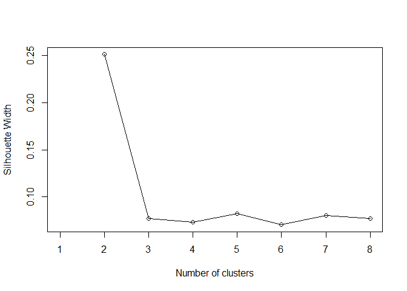

For the Human Resources department, the plot shows that 2 is the best number of clusters to use.

``` r
k <- 2
pam_fit_HR <- pam(gower_dist_HR, diss = TRUE, k)

pam_results_HR <- employees_HR %>%
  mutate(cluster = pam_fit_HR$clustering) %>%
  group_by(cluster) %>%
  do(the_summary = summary(.))

employees_HR <- cbind(employees_HR, pam_fit_HR$clustering)
```

Just as before, we will plot the difference in the attrition rates of the two clusters, along with differences in key attributes between the two.

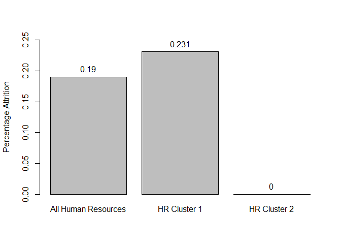

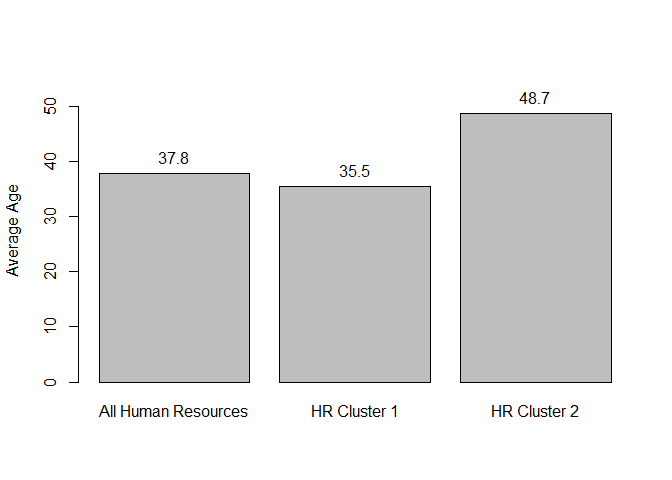

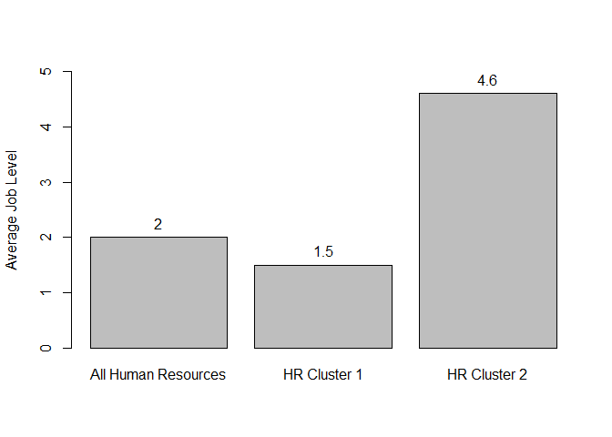

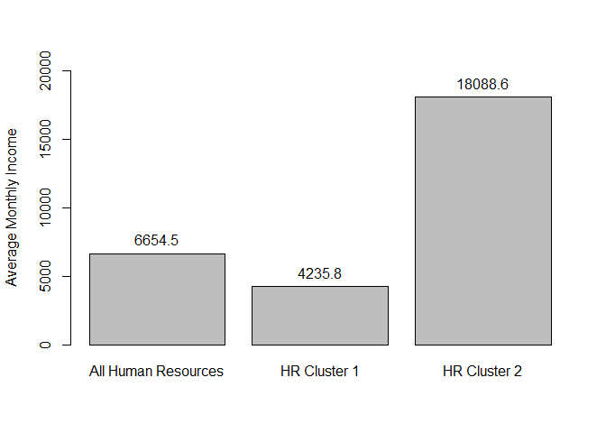

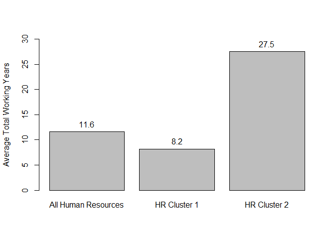

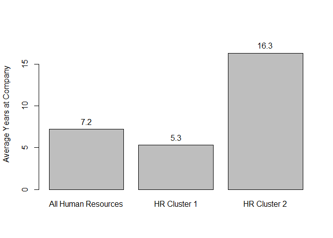

From looking at these plots, you can start to see a very clear story about the types of employees who are more likely to leave within the Human Resources department. One cluster actually has 0% attrition, but this cluster is significantly older, has been working for a much longer number of years, gets paid a lot more, and holds higher, more senior job roles. The cluster that is younger, gets paid less, and holds lower positions accounts for all of the attrition within HR. This breakdown gives us a very good look at the different characteristics between the two groups, and we will see if similar trends emerge in Research & Development and Sales.

### PAM Clustering with Gower Distance on Research & Development Department

``` r
employees_rd <- employees[employees$Department == 'Research & Development',]
employees_scaled_rd <- employees_scaled[employees_scaled$Department == 'Research & Development',]

gower_dist_rd <- daisy(employees_scaled_rd, metric = "gower")

sil_width <- c(NA)
for(i in 2:8){  
  pam_fit_rd <- pam(gower_dist_rd, diss = TRUE, k = i)  
  sil_width[i] <- pam_fit_rd$silinfo$avg.width  
}
plot(1:8, sil_width,
     xlab = "Number of clusters",
     ylab = "Silhouette Width")
lines(1:8, sil_width)
```

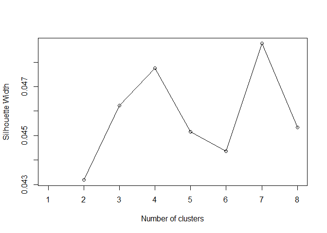

This Silhouette plot actually shows that 7 would be the ideal number of clusters, but in keeping with our conclusions from Part 1 to keep as small a number of clusters as possible, we will choose k=4 instead. There is also a peak in the coefficient value at 4, even though it is not as high as 7, but the tradeoff for greater simplicity is worth it in this case.

``` r
k <- 4
pam_fit_rd <- pam(gower_dist_rd, diss = TRUE, k)

pam_results_rd <- employees_rd %>%
  mutate(cluster = pam_fit_rd$clustering) %>%
  group_by(cluster) %>%
  do(the_summary = summary(.))

employees_rd <- cbind(employees_rd, pam_fit_rd$clustering)
```

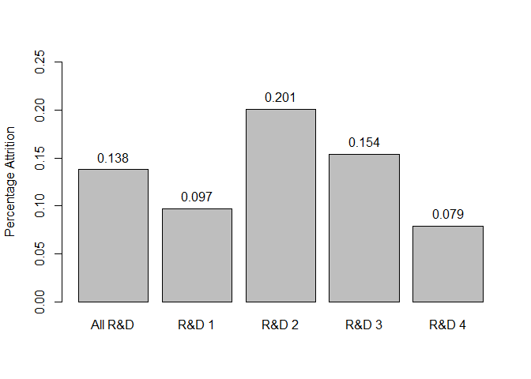

There are significant differences in the attrition rates between these 4 clusters, so now we will examine how they most differ once again on several of the varialbes.

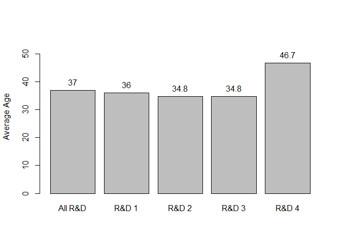

Just looking at the age chart, you can see that older employees have the lowest attrition rate, while the two clusters with the youngest employees have the two highest attrition rates. This relationship between age and attrition is one that continues to hold true across the different analyses.

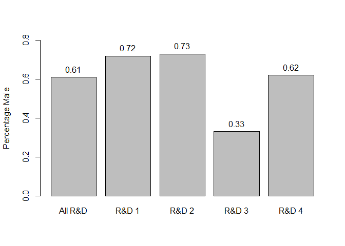

One interesting observation is that one of the clusters with the higher attrition is only about 33% male. This is even more striking since 61% of all Research & Development employees are male, so this group has really differentiated itself along gender lines.

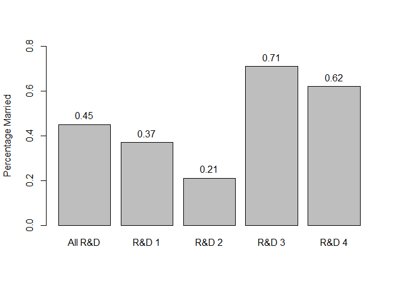

If you look at Marital Status, you can also see some significant differences, especially between the two clusters with the higher attrition. One of them is majority male, 79% of whom are not married, while the other is two-thirds female, 71% of whom are married. When targeting these two groups with efforts to try to reduce attrition, these demographic characteristics are very important to keep in mind for different potential initiatives.

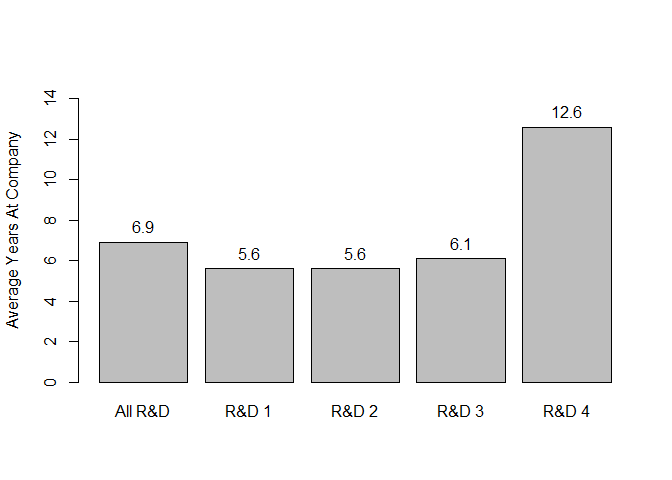

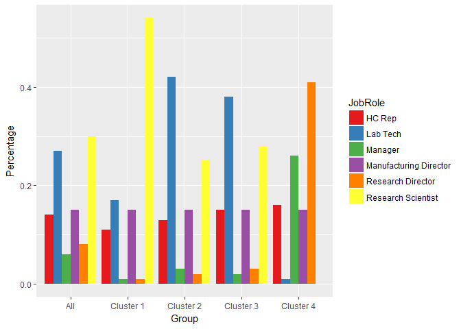

These last two plots illustrate the key differences between the jobs in each cluster. The two clusters with the lowest attrition consist of research scientists and research directors, respectively. The two clusters with the higher attrition consist of lab techs, which are lower level jobs. The research directors are also primarily made up of more senior people who have worked at the company for a longer period of time.

### PAM Clustering with Gower Distance on Sales Department

``` r
employees_sales <- employees[employees$Department == 'Sales',]
employees_scaled_sales <- employees_scaled[employees_scaled$Department == 'Sales',]

gower_dist_sales <- daisy(employees_scaled_sales, metric = "gower")

sil_width <- c(NA)
for(i in 2:8){  
  pam_fit_sales <- pam(gower_dist_sales, diss = TRUE, k = i)  
  sil_width[i] <- pam_fit_sales$silinfo$avg.width  
}
plot(1:8, sil_width,
     xlab = "Number of clusters",
     ylab = "Silhouette Width")
lines(1:8, sil_width)
```

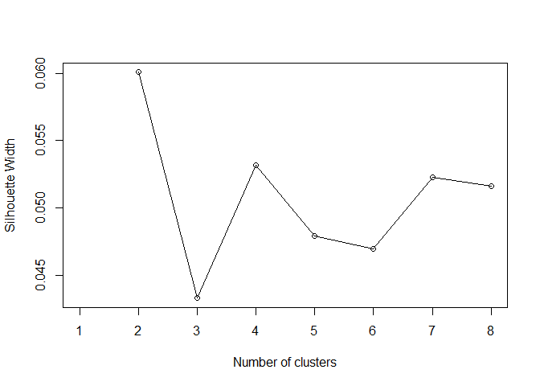

This chart of the Silhouette coefficients shows that 2 is the ideal number of clusters to use for the Sales department.

``` r
k <- 2
pam_fit_sales <- pam(gower_dist_sales, diss = TRUE, k)

pam_results_sales <- employees_sales %>%
  mutate(cluster = pam_fit_sales$clustering) %>%
  group_by(cluster) %>%
  do(the_summary = summary(.))

employees_sales <- cbind(employees_sales, pam_fit_sales$clustering)
```

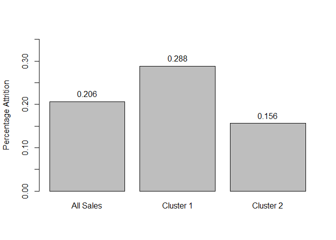

This breakdown shows that while Sales has a higher rate of attrition in general than the company overall, there is still a clear difference between a higher-attrition group and a lower-attrition group within Sales.

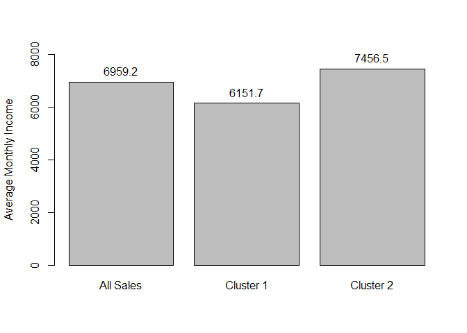

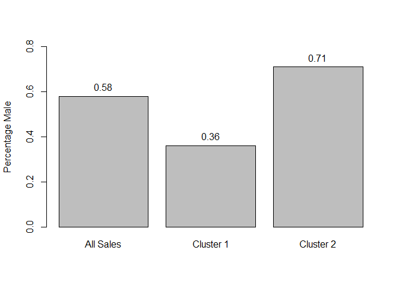

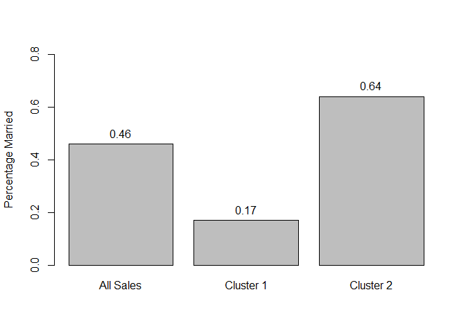

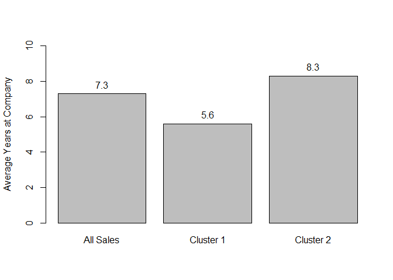

These plots help to illustrate the difference between the two sales clusters. The group with higher attrition is more female, gets paid less, is married less often, and has worked for the company for fewer years. The group with less attrition is more male, gets paid more, is majority married, and has been at the company longer.

### Conclusions

This analysis attempts to find important characteristics of employeees at a company who are more likely to leave. By looking at clusters by Department, we are also able to get down to a higher level of detail and allow managers to put more actionable, department-specific results into action. The characteristics of the at-risk clusters for each department as summarized as follows:

Human Resources - Younger, lower paid, hold lower level positions, worked at company for fewer years

Research & Development - Laboratory technicians, female/married, male/not married

Sales - Females, not married, worked at company for fewer years

There are many different ways that future studies could further this analysis. Specifically, with as many variables as there are in the data, different breakdowns could be performed. It might be interesting to break out males and females to see what trends occur, as well as age or how long an employee has worked at the company.
