Association Rule Mining for Predicting NFL Game Winners and Spread Covers
================

Introduction
------------

This analysis looked at a dataset of NFL games, which was found on Kaggle at:

<https://www.kaggle.com/tobycrabtree/nfl-scores-and-betting-data>

The goal was to use association rule mining to find relationships between variables around NFL games and

1.  Whether the favored team wins the game

2.  Whether the favored team covers the pre-game betting point spread

With the Supreme Court ruling this past year that allows states to legalize sports gambling, there has already been a huge uptick in the number of states where it has been adopted. This analysis will look at over 9,000 NFL game outcomes from 1979-2018 to identify trends on potential factors that could influence the outcome of a game.

The Data
--------

This dataset consists of 12,400 NFL games spanning the 1966 season through the midway point (November 15, 2018) of the current 2018 season with different attritubes for each game. The following is a complete listing, along with a brief description (where necessary) for every variable:

schedule\_date - date of game

schedule\_season - the year of the football season in which the game took place

schedule\_week - the week of the season for the game; also includes playoff round descriptions

team\_home - name of home team

team\_away - name of away team

stadium - name of stadium where game took place

team\_favorite\_id - 3-digit ID for team that was favored going into the game; also can be PICK if there was no favorite

spread\_favorite - how much the favorite was favored to win by

over\_under\_line - the total number of expected points to be scored between the two teams

weather\_detail - a text field with various details on the weather conditions for the game that day

weather\_temperature - temperature during the game

weather\_wind\_mph - wind (in mph) during the game

weather\_humidity - humidity during the game

score\_home - how many points the home team scored

score\_away - how many points the away team scored

stadium\_neutral - whether the game was at a neutral site or not (TRUE/FALSE)

schedule\_playoff - whether the game was a playoff game (TRUE/FALSE)

A second dataset contains information on teams that will be used to convert team names into team ID numbers so that the identifiers for teams will be consistent and can be matched up accordingly. The variables in the team dataset are:

team\_name - the name of the team

team\_short\_short - nickname/short name for team

team\_id - unique 3-digit team ID

team\_id\_pfr - alternate 3-digit team ID

team\_conference - conference of team (AFC/NFC)

team\_division - division of team

team\_conference\_pre2002 - conference team was in prior to realignment in 2002

team\_division\_pre2002 - division team was in prior to realignment in 2002

The third dataset contains information on each stadium in which the games are played and is made up of the following variables:

stadium\_name - name of stadium

stadium\_location - city/state of stadium

stadium\_open - which year the stadium opened

stadium\_close - which year the stadium closed

stadium\_type - what type of stadium it is (indoor/outdoor/retractable)

stadium\_address - address of stadium

stadium\_weather\_station\_code

stadium\_weather\_type - type of weather typical for the stadium (cold/dome/moderate/warm)

stadium\_capacity - fan capacity for stadium

stadium\_surface - type of playing surface in stadium (FieldTurf/Grass)

STATION

LATITUDE

LONGITUDE

ELEVATION

Approach
--------

With this large amount of data, it was important to decide on a focused direction for how to approach it. This analysis attempted to find insights around 3 questions:

1.  What associations could be found for games in which the favorite won?

2.  What associations could be found for games in which the favorite covered the point spread?

3.  What associations could be found for games where the final scoring margin fell outside the predicted margins?

### Cleaning & Formatting the Data

Before assocation rule mining could begin, several steps needed to be taken to clean and format the data to get it into the proper format for analysis. Here is a brief look at the original data, along with the data types for each variable:

    ## 'data.frame':    12400 obs. of  17 variables:
    ##  $ schedule_date      : Factor w/ 2292 levels "01/01/1967","01/01/1978",..: 239 245 253 307 325 325 325 343 343 343 ...
    ##  $ schedule_season    : int  1966 1966 1966 1966 1966 1966 1966 1966 1966 1966 ...
    ##  $ schedule_week      : chr  "1" "1" "1" "2" ...
    ##  $ team_home          : Factor w/ 41 levels "Arizona Cardinals",..: 23 15 33 23 14 15 33 2 6 13 ...
    ##  $ team_away          : Factor w/ 41 levels "Arizona Cardinals",..: 29 12 6 28 3 29 25 22 19 8 ...
    ##  $ stadium            : Factor w/ 104 levels "Alamo Dome","Alltel Stadium",..: 64 75 8 64 41 75 8 7 100 91 ...
    ##  $ team_favorite_id   : Factor w/ 34 levels "","ARI","ATL",..: 1 1 1 1 1 1 1 1 1 1 ...
    ##  $ spread_favorite    : num  NA NA NA NA NA NA NA NA NA NA ...
    ##  $ over_under_line    : num  NA NA NA NA NA NA NA NA NA NA ...
    ##  $ weather_detail     : Factor w/ 2003 levels "","-2 degrees-  humidity 51%- wind 11 mph- wind chill -19",..: 1 1 1 1 1579 1 1 1805 1 1700 ...
    ##  $ weather_temperature: int  83 81 70 82 64 77 69 71 63 67 ...
    ##  $ weather_wind_mph   : int  6 7 7 11 8 6 9 7 11 7 ...
    ##  $ weather_humidity   : Factor w/ 96 levels "","10","100",..: 68 67 79 75 59 79 78 52 70 70 ...
    ##  $ score_home         : int  14 45 27 14 24 31 24 14 20 14 ...
    ##  $ score_away         : int  23 7 7 19 3 0 0 19 42 3 ...
    ##  $ stadium_neutral    : logi  FALSE FALSE FALSE FALSE FALSE FALSE ...
    ##  $ schedule_playoff   : logi  FALSE FALSE FALSE FALSE FALSE FALSE ...

After thinking through our approach and deciding which variables made the most sense to use, several were immediately removed - schedule\_date, over\_under\_line, weather\_detail, and weather\_humidity.

The schedule\_date was going to provide too much detail than what we needed since it is the exact day on which the game took place. We kept the schedule\_season so that we still had the year variable, in case there were trends over a period of time.

Since we were not concerned in this analysis with the prediction of how many points would be scored and were focused more on the winners/favored team heading into a game, we removed over\_under\_line.

The weather\_detail would have required quite a bit of cleanup since it is just a text field with some key facts about the weather. Many of these are also captured in the weather\_temperature, weather\_wind\_mph, and weather\_humidity variables - which are broken out in a cleaner numeric format. These were the ones we kept, while eliminating the weather\_detail column.

Over 32% of the rows had missing data in the weather\_humidity column. With this amount of missing data and the reasoning that this variable would probably have little (or no) impact on the analysis at the end, we removed it.

``` r
sum(table(games$weather_humidity)[1])/nrow(games)
```

    ## [1] 0.323629

``` r
games$schedule_date <- NULL
games$over_under_line <- NULL
games$weather_detail <- NULL
games$weather_humidity <- NULL
```

The next bit of cleanup required removing rows in which there is not a favorite team listed. You can see that there are 2,601 of them, with many occurring in the earlier years. This is likely due to the fact that the betting/favorite data was not as widespread 40-50 year ago and probably just not able to be collected. Since we were looking for associations on whether or not the favorite won, this was a necessary piece of information for our analysis, and we were not be able to use rows that do not contain it.

``` r
table(games$team_favorite_id)
```

    ## 
    ##       ARI  ATL  BAL  BUF  CAR  CHI  CIN  CLE  DAL  DEN  DET   GB  HOU  IND 
    ## 2601  210  290  212  299  185  299  262  201  413  420  235  380  108  290 
    ##  JAX   KC  LAC  LAR  MIA  MIN   NE   NO  NYG  NYJ  OAK  PHI PICK  PIT  SEA 
    ##  160  303  319  298  354  354  423  318  328  281  313  371  143  443  321 
    ##   SF   TB  TEN  WAS 
    ##  415  236  297  318

Once these were removed, we found that we had very few games for the 1966-1978 seasons (only 1 from 1966-77 and 10 in 1978). Therefore, we went ahead and narrowed down our dataset to only the 1979-2018 seasons. We also went ahead and removed rows with any other missing information.

This step reduced the dataset to 9,405 rows.

The next step required converting the team names in the team\_home and team\_away columns into the 3-digit team ID numbers. Since this was the format that the team\_favorite\_id column was, we needed to get them into the same format so that we could easily identify which team was the favorite/underdog and whether the favorite was the home team or away team. We did this by utilizing the 'teams' dataset referenced in the Data section above.

We then needed to do some work to get the predicted game results and actual game results into a better format. When listing the spread, it is typically done by listing the numbers with a negative value, as you can see in the spread\_favorite column. However, practically speaking, if we want to know how much the favorite was predicted to win by, it makes more sense to convert it to a positive value instead, which we did. We also re-labeled the column to fav\_margin\_predicted to make it clearer that this was the value the favorite was expected to win by.

Since we had the scores for the home and away teams and knew which one was the favorite, we also calculated the favorite's actual margin of victory and difference between what was predicted vs. what actually happened. An important note here is that if a favorite was expected to win but did not, then their actual margin and margin difference would be negative. For example, in Week 3 in 2011, Arizona was favored by 3 going into the game against Seattle, but they actually ended up losing by 3. Therefore, their actual margin of "victory" was -3, since they lost as a favorite. The difference was -6, since it was a 6-point (3 to -3) that the the predicted margin missed by.

    ##     schedule_season schedule_week team_favorite_id home_team_favorite
    ## 150            2011             3              ARI                 No
    ##     team_underdog_id score_home score_away fav_margin_predicted
    ## 150              SEA         13         10                    3
    ##     fav_margin_actual fav_margin_difference
    ## 150                -3                    -6

From this information, we also calculated two more variables for whether or not the favorite won and whether or not the favorite covered the spread, which was the focus of our analysis for questions 1 and 2.

At this point, we now also added in two of the variables around the stadium in which the game was played - stadium\_type and stadium\_surface - which were found in the 'stadiums' dataset.

While we were not focused on the over/under as far as predicted points scored, we thought it might be interesting to see if higher-scoring games or higher-scoring games were more prone to upsets. Therefore, we added the score\_home and score\_away variables for a new points\_scored variable to account for this.

Since we were going to convert all of the variables to factors before running association rules, we binned the numeric variables into ranges that would more easily convert to factors - including weather\_temperature, weather\_wind\_mph, fav\_margin\_predicted, fav\_margin\_difference, and points\_scored.

Finally, the last step of the data cleaning process was to convert the remaining variables that were not yet factors into the factor data type.

After all of the cleaning steps and re-formatting, the following is an outline of the dataset we used for the analyis:

``` r
str(games)
```

    ## 'data.frame':    9228 obs. of  17 variables:
    ##  $ stadium              : Factor w/ 104 levels "Alamo Dome","Alltel Stadium",..: 1 1 1 4 4 4 4 4 4 4 ...
    ##  $ schedule_season      : Factor w/ 40 levels "1979","1980",..: 27 27 27 9 12 6 5 8 10 11 ...
    ##  $ schedule_week        : Factor w/ 22 levels "1","10","11",..: 8 15 13 13 18 7 17 11 16 11 ...
    ##  $ team_favorite_id     : Factor w/ 34 levels "","ARI","ATL",..: 23 3 5 31 19 19 28 31 28 19 ...
    ##  $ weather_temperature  : Factor w/ 11 levels "(-10,0]","(0,10]",..: 9 9 9 8 8 7 8 8 8 8 ...
    ##  $ weather_wind_mph     : Factor w/ 4 levels "(0,10]","(10,20]",..: NA NA NA 1 1 1 1 1 1 2 ...
    ##  $ stadium_neutral      : Factor w/ 2 levels "FALSE","TRUE": 2 2 2 1 1 1 1 1 1 1 ...
    ##  $ schedule_playoff     : Factor w/ 2 levels "FALSE","TRUE": 1 1 1 1 1 1 1 1 1 1 ...
    ##  $ home_team_favorite   : Factor w/ 2 levels "No","Yes": 2 1 1 1 2 2 1 1 1 2 ...
    ##  $ team_underdog_id     : Factor w/ 32 levels "ARI","ATL","BAL",..: 11 22 22 18 31 31 18 18 18 14 ...
    ##  $ fav_margin_predicted : Factor w/ 4 levels "(-1,3]","(3,7]",..: 1 2 1 2 2 3 1 1 1 2 ...
    ##  $ fav_margin_difference: Factor w/ 16 levels "(-56,-49]","(-49,-42]",..: 8 8 7 11 8 8 10 8 9 10 ...
    ##  $ favorite_win         : Factor w/ 2 levels "No","Yes": 1 2 1 2 2 2 2 1 2 2 ...
    ##  $ favorite_beat_spread : Factor w/ 2 levels "No","Yes": 1 1 1 2 1 1 2 1 2 2 ...
    ##  $ stadium_type         : Factor w/ 3 levels "indoor","outdoor",..: 1 1 1 2 2 2 2 2 2 2 ...
    ##  $ stadium_surface      : Factor w/ 3 levels "","FieldTurf",..: 2 2 2 1 1 1 1 1 1 1 ...
    ##  $ points_scored        : Factor w/ 8 levels "(0,14]","(14,28]",..: 2 5 2 3 3 4 6 3 4 4 ...

### Question 1 - Associations for Games in Which the Favorite Won

The first question we looked at was discovering any potential associations between whether or not the favored team going into the game actually won. In order to do this, we removed the two variables - fav\_beat\_spread and fav\_margin\_difference - since the information on whether or not the favorite won is also contained in these variables. Leaving them in would have confused the results since there would obviously have been strong relationships between them.

When we initially ran the 'apriori' algorithm in the 'arules' package, we looked at all rules generated and sorted by lift since 1,963 rules were generated. We also lowered the confidence parameter to 0.5, since the default is 0.8, which gave us a broader set of rules to look at.

``` r
rules.wins <- apriori(games.fav.won,
                          control = list(verbose=F),
                          parameter = list(minlen=2, supp=0.1, conf=0.5)) %>% sort(by="lift")
summary(rules.wins)
```

    ## set of 1963 rules
    ## 
    ## rule length distribution (lhs + rhs):sizes
    ##   2   3   4   5   6 
    ## 113 507 770 472 101 
    ## 
    ##    Min. 1st Qu.  Median    Mean 3rd Qu.    Max. 
    ##    2.00    3.00    4.00    3.97    5.00    6.00 
    ## 
    ## summary of quality measures:
    ##     support         confidence          lift            count     
    ##  Min.   :0.1007   Min.   :0.5027   Min.   :0.7269   Min.   : 929  
    ##  1st Qu.:0.1164   1st Qu.:0.6791   1st Qu.:0.9994   1st Qu.:1074  
    ##  Median :0.1438   Median :0.9729   Median :1.0036   Median :1327  
    ##  Mean   :0.1769   Mean   :0.8532   Mean   :1.0865   Mean   :1632  
    ##  3rd Qu.:0.2018   3rd Qu.:0.9959   3rd Qu.:1.0355   3rd Qu.:1862  
    ##  Max.   :0.9902   Max.   :1.0000   Max.   :3.6681   Max.   :9138  
    ## 
    ## mining info:
    ##           data ntransactions support confidence
    ##  games.fav.won          9228     0.1        0.5

``` r
inspect(rules.wins[1:10])
```

    ##      lhs                              rhs                             support confidence     lift count
    ## [1]  {weather_temperature=(70,80],                                                                     
    ##       stadium_neutral=FALSE,                                                                           
    ##       stadium_surface=}            => {stadium_type=indoor}         0.1171435  0.7051533 3.668069  1081
    ## [2]  {weather_temperature=(70,80],                                                                     
    ##       stadium_neutral=FALSE,                                                                           
    ##       schedule_playoff=FALSE,                                                                          
    ##       stadium_surface=}            => {stadium_type=indoor}         0.1171435  0.7051533 3.668069  1081
    ## [3]  {weather_temperature=(70,80],                                                                     
    ##       stadium_surface=}            => {stadium_type=indoor}         0.1177937  0.7049287 3.666901  1087
    ## [4]  {weather_temperature=(70,80],                                                                     
    ##       schedule_playoff=FALSE,                                                                          
    ##       stadium_surface=}            => {stadium_type=indoor}         0.1177937  0.7049287 3.666901  1087
    ## [5]  {weather_temperature=(70,80],                                                                     
    ##       schedule_playoff=FALSE,                                                                          
    ##       favorite_win=Yes}            => {stadium_type=indoor}         0.1221283  0.5712114 2.971329  1127
    ## [6]  {weather_temperature=(70,80],                                                                     
    ##       favorite_win=Yes}            => {stadium_type=indoor}         0.1232120  0.5710698 2.970593  1137
    ## [7]  {weather_temperature=(70,80],                                                                     
    ##       stadium_neutral=FALSE,                                                                           
    ##       favorite_win=Yes}            => {stadium_type=indoor}         0.1223450  0.5704901 2.967578  1129
    ## [8]  {weather_temperature=(70,80],                                                                     
    ##       stadium_neutral=FALSE,                                                                           
    ##       schedule_playoff=FALSE,                                                                          
    ##       favorite_win=Yes}            => {stadium_type=indoor}         0.1214781  0.5704835 2.967543  1121
    ## [9]  {weather_temperature=(70,80],                                                                     
    ##       schedule_playoff=FALSE}      => {stadium_type=indoor}         0.1903988  0.5695300 2.962583  1757
    ## [10] {home_team_favorite=Yes,                                                                          
    ##       stadium_type=indoor}         => {weather_temperature=(70,80]} 0.1224534  0.9973522 2.960298  1130

One thing we observed when we looked at the top ten rules above was that many of the rules were associations that had nothing to do with whether or not the favored team won the game. Therefore, we needed to narrow down our results to only view rules that included whether or not the favorite won.

``` r
rules.wins <- apriori(games.fav.won,
                 control = list(verbose=F),
                 parameter = list(minlen=2, supp=0.1, conf=0.5),
                 appearance = list(rhs=c("favorite_win=Yes", "favorite_win=No"),
                                   default="lhs")) %>% sort(by="lift")
summary(rules.wins)
```

    ## set of 259 rules
    ## 
    ## rule length distribution (lhs + rhs):sizes
    ##  2  3  4  5  6 
    ## 19 68 97 61 14 
    ## 
    ##    Min. 1st Qu.  Median    Mean 3rd Qu.    Max. 
    ##   2.000   3.000   4.000   3.934   5.000   6.000 
    ## 
    ## summary of quality measures:
    ##     support         confidence          lift           count     
    ##  Min.   :0.1010   Min.   :0.5449   Min.   :0.827   Min.   : 932  
    ##  1st Qu.:0.1198   1st Qu.:0.6595   1st Qu.:1.001   1st Qu.:1106  
    ##  Median :0.1453   Median :0.6667   Median :1.012   Median :1341  
    ##  Mean   :0.1774   Mean   :0.6703   Mean   :1.017   Mean   :1637  
    ##  3rd Qu.:0.2045   3rd Qu.:0.6793   3rd Qu.:1.031   3rd Qu.:1887  
    ##  Max.   :0.6556   Max.   :0.8181   Max.   :1.242   Max.   :6050  
    ## 
    ## mining info:
    ##           data ntransactions support confidence
    ##  games.fav.won          9228     0.1        0.5

``` r
inspect(rules.wins[1:10])
```

    ##      lhs                              rhs                  support confidence     lift count
    ## [1]  {schedule_playoff=FALSE,                                                               
    ##       home_team_favorite=Yes,                                                               
    ##       fav_margin_predicted=(7,14],                                                          
    ##       stadium_type=outdoor}        => {favorite_win=Yes} 0.1106415  0.8181090 1.241696  1021
    ## [2]  {stadium_neutral=FALSE,                                                                
    ##       schedule_playoff=FALSE,                                                               
    ##       home_team_favorite=Yes,                                                               
    ##       fav_margin_predicted=(7,14],                                                          
    ##       stadium_type=outdoor}        => {favorite_win=Yes} 0.1106415  0.8181090 1.241696  1021
    ## [3]  {home_team_favorite=Yes,                                                               
    ##       fav_margin_predicted=(7,14],                                                          
    ##       stadium_type=outdoor}        => {favorite_win=Yes} 0.1115085  0.8179650 1.241477  1029
    ## [4]  {stadium_neutral=FALSE,                                                                
    ##       home_team_favorite=Yes,                                                               
    ##       fav_margin_predicted=(7,14],                                                          
    ##       stadium_type=outdoor}        => {favorite_win=Yes} 0.1115085  0.8179650 1.241477  1029
    ## [5]  {home_team_favorite=Yes,                                                               
    ##       fav_margin_predicted=(7,14]} => {favorite_win=Yes} 0.1391417  0.8090737 1.227982  1284
    ## [6]  {schedule_playoff=FALSE,                                                               
    ##       home_team_favorite=Yes,                                                               
    ##       fav_margin_predicted=(7,14]} => {favorite_win=Yes} 0.1380581  0.8088889 1.227702  1274
    ## [7]  {stadium_neutral=FALSE,                                                                
    ##       schedule_playoff=FALSE,                                                               
    ##       home_team_favorite=Yes,                                                               
    ##       fav_margin_predicted=(7,14]} => {favorite_win=Yes} 0.1380581  0.8088889 1.227702  1274
    ## [8]  {stadium_neutral=FALSE,                                                                
    ##       home_team_favorite=Yes,                                                               
    ##       fav_margin_predicted=(7,14]} => {favorite_win=Yes} 0.1389250  0.8088328 1.227617  1282
    ## [9]  {schedule_playoff=FALSE,                                                               
    ##       fav_margin_predicted=(7,14],                                                          
    ##       stadium_type=outdoor}        => {favorite_win=Yes} 0.1307976  0.8019934 1.217236  1207
    ## [10] {fav_margin_predicted=(7,14],                                                          
    ##       stadium_type=outdoor}        => {favorite_win=Yes} 0.1316645  0.8019802 1.217216  1215

There were two new observations we made here. The first was that the number of rules had been reduced to 259, which is a smaller number than the original 1,963 rules. The second was that while this number was smaller, we still observed some redundancy in the results. This means that a rule may show up that is a subset of another rule, meaning that the larger rule is not really adding any more information. However, we addressed the redundancy to reduce the number of rules either further to a total of 19.

``` r
subset.matrix <- is.subset(rules.wins, rules.wins)
redundant <- colSums(subset.matrix) > 1
rules.wins.reduced <- rules.wins[!redundant] 
summary(rules.wins.reduced)
```

    ## set of 19 rules
    ## 
    ## rule length distribution (lhs + rhs):sizes
    ##  2 
    ## 19 
    ## 
    ##    Min. 1st Qu.  Median    Mean 3rd Qu.    Max. 
    ##       2       2       2       2       2       2 
    ## 
    ## summary of quality measures:
    ##     support         confidence          lift            count     
    ##  Min.   :0.1168   Min.   :0.5450   Min.   :0.8271   Min.   :1078  
    ##  1st Qu.:0.1750   1st Qu.:0.6534   1st Qu.:0.9917   1st Qu.:1615  
    ##  Median :0.2174   Median :0.6635   Median :1.0070   Median :2006  
    ##  Mean   :0.2788   Mean   :0.6613   Mean   :1.0037   Mean   :2573  
    ##  3rd Qu.:0.3068   3rd Qu.:0.6701   3rd Qu.:1.0170   3rd Qu.:2832  
    ##  Max.   :0.6556   Max.   :0.7965   Max.   :1.2088   Max.   :6050  
    ## 
    ## mining info:
    ##           data ntransactions support confidence
    ##  games.fav.won          9228     0.1        0.5

``` r
inspect(rules.wins.reduced[1:6])
```

    ##     lhs                              rhs                support  
    ## [1] {fav_margin_predicted=(7,14]} => {favorite_win=Yes} 0.1704595
    ## [2] {stadium_surface=FieldTurf}   => {favorite_win=Yes} 0.1377330
    ## [3] {home_team_favorite=Yes}      => {favorite_win=Yes} 0.4523190
    ## [4] {fav_margin_predicted=(3,7]}  => {favorite_win=Yes} 0.2768747
    ## [5] {points_scored=(42,56]}       => {favorite_win=Yes} 0.2173819
    ## [6] {weather_temperature=(60,70]} => {favorite_win=Yes} 0.1168184
    ##     confidence lift     count
    ## [1] 0.7964557  1.208831 1573 
    ## [2] 0.6815013  1.034358 1271 
    ## [3] 0.6800261  1.032119 4174 
    ## [4] 0.6746765  1.023999 2555 
    ## [5] 0.6722520  1.020319 2006 
    ## [6] 0.6679058  1.013723 1078

You can now see the top handful of rules associated with a favored team winning the game.

The first is if the predicted margin of victory is 7-14 points. This should not be too surprising to see this rule with the strongest lift, because in the NFL, being more than a touchdown favorite means that the odds are pretty good that you will win the game. You can also see this relationship illustrated in the following chart, where the winning percentage of the favorite increases the more they are favored going into a game - which also makes complete logical sense.

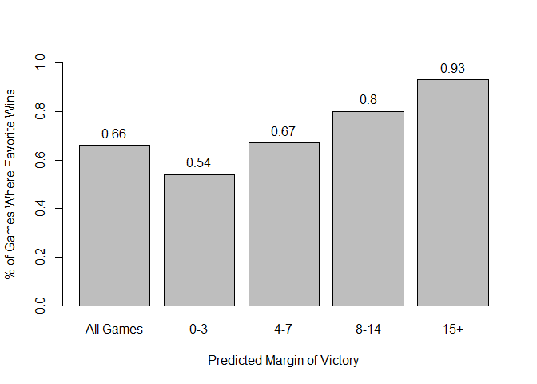

The second rule is if the stadium surface is field turf. This one requires a bit more thought, but since turf is more immune to weather and elements than grass, this could point to an "equal playing field" benefiting the favored team. This makes sense because there is less opportunity for unexpected factors to influence game results and add extra variation to a game which could open up the door to an underdog winning. You can see that while it is only a slight difference, the favorite wins in games played on turf is slightly higher than the average win rate for favorites across all games, which is also the same as the win rate on grass (66%).

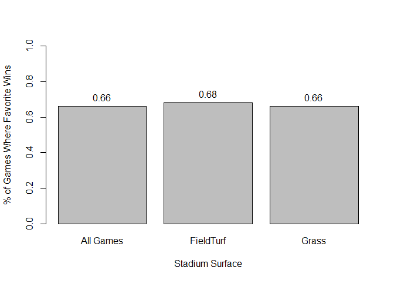

The third rule is unsurprising, since home teams tend to win more than away teams because of home-field advantage. Coupling a home team also being favored would then really put the odds in their corner. This relationship is illustrated below.

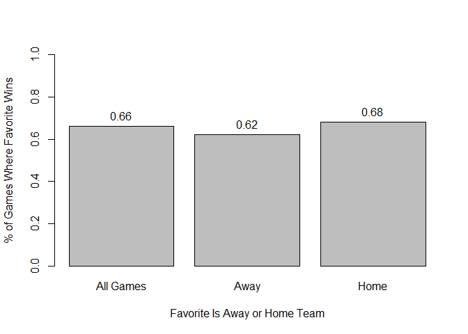

The fourth rule is similar to Rule 1, just with a lower impact, since the expected margin of victory is lower.

The 5th rule indicates that higher scoring games also favor the favorites, since the average number of points scored in a game is 41.8. This could also make sense, because higher scoring games likely indicate more possessions by each team, which would mean there is more chance over the course of the game for the favored team to show they are the better team. If you plot the results (below), however, it appears as though this relationship may not necessarily hold at the higher levels of points being scored. It could be that the top scoring groups have smaller sample sizes so the comparison may not be as valid, or it could be that this is just not a linear relationship and instead, it peaks out in the 43-56 point range.

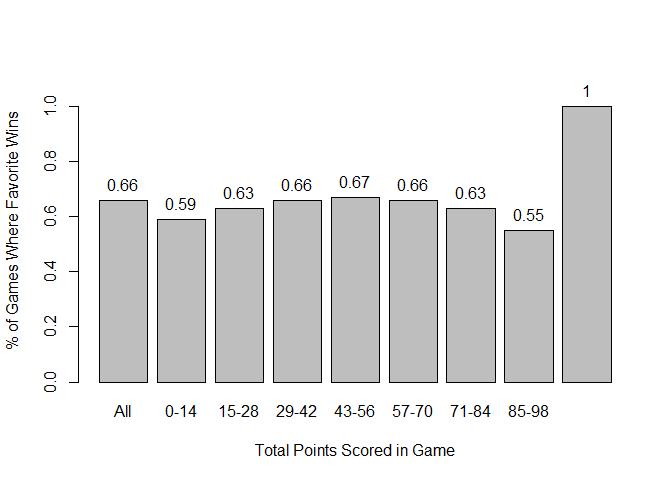

The 6th rule around weather could also be similar to the 2nd rule with the field turf. A temperature range of 60-70 degrees, is pretty "ideal" weather for a football game, meaning there is less opportunity for really cold temperatures (and/or snow) or really hot temperatures (which can take additional, unexpected physical tolls on players) to throw additional variation into a game for an underdog team. However, if you plot this relationship, it is not completely clear if it would actually hold across the spectrum. Part of the variation could also be due to the small sample sizes at some of the temperature ranges.

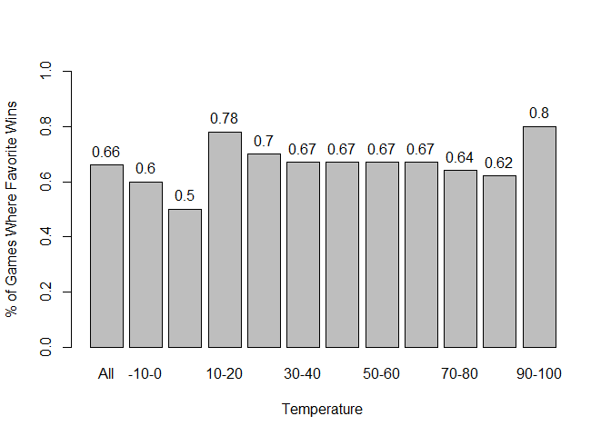

Looking at the overall results for Question 1, you can also see that the support and confidence are high enough for these top rules that they occur fairly frequently and the associations hold true a good majority of the time.

### Question 2 - Associations for Games in Which the Favorite Covered the Spread

After looking for assocations between variables and whether or not the favored team won the game, the analysis was taken a step further. Question 2 asks if there are any assocations between variables and whether the favored team covered the projected point spread. In simple terms, the spread is how much the favored team is expected to win by. So which associations could be found when a team did or did not win by at least the expected margin of victory?

In sports gambling terms, this is an important next step, because the spread is how many bets are made. As we saw in the first question, there is a strong relationship between the expected margin of victory (the spread) and whether or not the favorite won the game. This makes complete sense, because if a team is expected to win by 30 points, that means the belief is that the favorite is a significantly better team than their opponent. Compare this situation to a game where a team is only favored by 1 point. The predicted odds of the favorite winning are only slightly better than a coin flip, so you would expect the win probabilities to match up accordingly. That is why most sports betting is not done around just picking winners, but instead, is focused on picking whether or not a team ends up over or under their predicted margin of victory.

Having said that, we used almost the same variables as in Question 1. The only difference was that we took out the favorite\_win variable and substituted it with favorite\_beat\_spread, since that was now our focus.

Just as before, we ran the 'apriori' algorithm after we lowered the confidence parameter to 0.5 to generate a large number of rules (1,843) to initially review.

``` r
rules.fav.spread <- apriori(games.fav.spread,
                            control = list(verbose=F),
                            parameter = list(minlen=2, supp=0.1, conf=0.5)) %>% sort(by="lift")
summary(rules.fav.spread)
```

    ## set of 1843 rules
    ## 
    ## rule length distribution (lhs + rhs):sizes
    ##   2   3   4   5   6 
    ## 111 498 740 421  73 
    ## 
    ##    Min. 1st Qu.  Median    Mean 3rd Qu.    Max. 
    ##   2.000   3.000   4.000   3.917   5.000   6.000 
    ## 
    ## summary of quality measures:
    ##     support         confidence          lift            count     
    ##  Min.   :0.1003   Min.   :0.5027   Min.   :0.7269   Min.   : 926  
    ##  1st Qu.:0.1141   1st Qu.:0.6717   1st Qu.:0.9980   1st Qu.:1053  
    ##  Median :0.1433   Median :0.9866   Median :1.0021   Median :1322  
    ##  Mean   :0.1735   Mean   :0.8449   Mean   :1.0837   Mean   :1601  
    ##  3rd Qu.:0.1903   3rd Qu.:0.9961   3rd Qu.:1.0193   3rd Qu.:1756  
    ##  Max.   :0.9902   Max.   :1.0000   Max.   :3.6681   Max.   :9138  
    ## 
    ## mining info:
    ##              data ntransactions support confidence
    ##  games.fav.spread          9228     0.1        0.5

``` r
inspect(rules.fav.spread[1:10])
```

    ##      lhs                              rhs                             support confidence     lift count
    ## [1]  {weather_temperature=(70,80],                                                                     
    ##       stadium_neutral=FALSE,                                                                           
    ##       stadium_surface=}            => {stadium_type=indoor}         0.1171435  0.7051533 3.668069  1081
    ## [2]  {weather_temperature=(70,80],                                                                     
    ##       stadium_neutral=FALSE,                                                                           
    ##       schedule_playoff=FALSE,                                                                          
    ##       stadium_surface=}            => {stadium_type=indoor}         0.1171435  0.7051533 3.668069  1081
    ## [3]  {weather_temperature=(70,80],                                                                     
    ##       stadium_surface=}            => {stadium_type=indoor}         0.1177937  0.7049287 3.666901  1087
    ## [4]  {weather_temperature=(70,80],                                                                     
    ##       schedule_playoff=FALSE,                                                                          
    ##       stadium_surface=}            => {stadium_type=indoor}         0.1177937  0.7049287 3.666901  1087
    ## [5]  {favorite_beat_spread=No,                                                                         
    ##       stadium_type=indoor}         => {weather_temperature=(70,80]} 0.1044647  0.9989637 2.965081   964
    ## [6]  {schedule_playoff=FALSE,                                                                          
    ##       favorite_beat_spread=No,                                                                         
    ##       stadium_type=indoor}         => {weather_temperature=(70,80]} 0.1037061  0.9989562 2.965059   957
    ## [7]  {stadium_neutral=FALSE,                                                                           
    ##       favorite_beat_spread=No,                                                                         
    ##       stadium_type=indoor}         => {weather_temperature=(70,80]} 0.1037061  0.9989562 2.965059   957
    ## [8]  {stadium_neutral=FALSE,                                                                           
    ##       schedule_playoff=FALSE,                                                                          
    ##       favorite_beat_spread=No,                                                                         
    ##       stadium_type=indoor}         => {weather_temperature=(70,80]} 0.1030559  0.9989496 2.965039   951
    ## [9]  {weather_temperature=(70,80],                                                                     
    ##       schedule_playoff=FALSE}      => {stadium_type=indoor}         0.1903988  0.5695300 2.962583  1757
    ## [10] {home_team_favorite=Yes,                                                                          
    ##       stadium_type=indoor}         => {weather_temperature=(70,80]} 0.1224534  0.9973522 2.960298  1130

Next, we narrowed down our list of rules to only rules with associations to whether or not the favorite team covered the spread (achieved at least the minimum predicted margin of victory).

``` r
rules.fav.spread <- apriori(games.fav.spread,
                            control = list(verbose=F),
                            parameter = list(minlen=2, supp=0.1, conf=0.5),
                      appearance = list(rhs=c("favorite_beat_spread=Yes", "favorite_beat_spread=No"),
                                   default="lhs")) %>% sort(by="lift")
summary(rules.fav.spread)
```

    ## set of 171 rules
    ## 
    ## rule length distribution (lhs + rhs):sizes
    ##  2  3  4  5  6 
    ## 17 53 64 32  5 
    ## 
    ##    Min. 1st Qu.  Median    Mean 3rd Qu.    Max. 
    ##   2.000   3.000   4.000   3.737   4.000   6.000 
    ## 
    ## summary of quality measures:
    ##     support         confidence          lift            count     
    ##  Min.   :0.1003   Min.   :0.5059   Min.   :0.9565   Min.   : 926  
    ##  1st Qu.:0.1120   1st Qu.:0.5196   1st Qu.:0.9824   1st Qu.:1034  
    ##  Median :0.1432   Median :0.5242   Median :0.9910   Median :1321  
    ##  Mean   :0.1668   Mean   :0.5261   Mean   :0.9946   Mean   :1539  
    ##  3rd Qu.:0.1817   3rd Qu.:0.5320   3rd Qu.:1.0058   3rd Qu.:1676  
    ##  Max.   :0.5270   Max.   :0.5625   Max.   :1.0634   Max.   :4863  
    ## 
    ## mining info:
    ##              data ntransactions support confidence
    ##  games.fav.spread          9228     0.1        0.5

``` r
inspect(rules.fav.spread[1:10])
```

    ##      lhs                              rhs                         support confidence     lift count
    ## [1]  {weather_temperature=(70,80],                                                                 
    ##       schedule_playoff=FALSE,                                                                      
    ##       home_team_favorite=Yes}      => {favorite_beat_spread=No} 0.1224534  0.5624689 1.063402  1130
    ## [2]  {weather_temperature=(70,80],                                                                 
    ##       stadium_neutral=FALSE,                                                                       
    ##       home_team_favorite=Yes}      => {favorite_beat_spread=No} 0.1229952  0.5621595 1.062817  1135
    ## [3]  {weather_temperature=(70,80],                                                                 
    ##       stadium_neutral=FALSE,                                                                       
    ##       schedule_playoff=FALSE,                                                                      
    ##       home_team_favorite=Yes}      => {favorite_beat_spread=No} 0.1221283  0.5620948 1.062694  1127
    ## [4]  {weather_temperature=(70,80],                                                                 
    ##       home_team_favorite=Yes}      => {favorite_beat_spread=No} 0.1234287  0.5616371 1.061829  1139
    ## [5]  {weather_temperature=(70,80],                                                                 
    ##       stadium_neutral=FALSE}       => {favorite_beat_spread=No} 0.1859558  0.5553398 1.049923  1716
    ## [6]  {weather_temperature=(70,80],                                                                 
    ##       stadium_neutral=FALSE,                                                                       
    ##       schedule_playoff=FALSE}      => {favorite_beat_spread=No} 0.1847638  0.5550130 1.049306  1705
    ## [7]  {weather_temperature=(70,80],                                                                 
    ##       schedule_playoff=FALSE}      => {favorite_beat_spread=No} 0.1855223  0.5549433 1.049174  1712
    ## [8]  {weather_temperature=(70,80]} => {favorite_beat_spread=No} 0.1869311  0.5548408 1.048980  1725
    ## [9]  {weather_temperature=(70,80],                                                                 
    ##       stadium_neutral=FALSE,                                                                       
    ##       stadium_type=indoor}         => {favorite_beat_spread=No} 0.1037061  0.5449886 1.030353   957
    ## [10] {weather_temperature=(70,80],                                                                 
    ##       stadium_type=indoor}         => {favorite_beat_spread=No} 0.1044647  0.5449406 1.030263   964

The rule list shrunk to 171 rules, but you can see from reviewing the top 10 by lift that there was still some redudancy we needed to address again. Once we did that, we were left with our final rule set of 17.

``` r
subset.matrix <- is.subset(rules.fav.spread, rules.fav.spread)
redundant <- colSums(subset.matrix) > 1
rules.fav.spread.reduced <- rules.fav.spread[!redundant] 
summary(rules.fav.spread.reduced)
```

    ## set of 17 rules
    ## 
    ## rule length distribution (lhs + rhs):sizes
    ##  2 
    ## 17 
    ## 
    ##    Min. 1st Qu.  Median    Mean 3rd Qu.    Max. 
    ##       2       2       2       2       2       2 
    ## 
    ## summary of quality measures:
    ##     support         confidence          lift            count     
    ##  Min.   :0.1046   Min.   :0.5111   Min.   :0.9662   Min.   : 965  
    ##  1st Qu.:0.1653   1st Qu.:0.5230   1st Qu.:0.9889   1st Qu.:1525  
    ##  Median :0.1869   Median :0.5248   Median :0.9921   Median :1725  
    ##  Mean   :0.2385   Mean   :0.5283   Mean   :0.9988   Mean   :2201  
    ##  3rd Qu.:0.2486   3rd Qu.:0.5358   3rd Qu.:1.0130   3rd Qu.:2294  
    ##  Max.   :0.5270   Max.   :0.5548   Max.   :1.0490   Max.   :4863  
    ## 
    ## mining info:
    ##              data ntransactions support confidence
    ##  games.fav.spread          9228     0.1        0.5

``` r
inspect(rules.fav.spread.reduced[1:6])
```

    ##     lhs                              rhs                         support confidence     lift count
    ## [1] {weather_temperature=(70,80]} => {favorite_beat_spread=No} 0.1869311  0.5548408 1.048980  1725
    ## [2] {stadium_type=indoor}         => {favorite_beat_spread=No} 0.1045730  0.5439684 1.028425   965
    ## [3] {fav_margin_predicted=(-1,3]} => {favorite_beat_spread=No} 0.1921326  0.5367847 1.014843  1773
    ## [4] {home_team_favorite=No}       => {favorite_beat_spread=No} 0.1794538  0.5359223 1.013213  1656
    ## [5] {stadium_surface=}            => {favorite_beat_spread=No} 0.2424144  0.5358084 1.012997  2237
    ## [6] {stadium_neutral=FALSE}       => {favorite_beat_spread=No} 0.5269831  0.5294502 1.000977  4863

Of these 17 rules, only 6 of them had a lift greater than 1. If you take a closer look at them, some of them make sense but others are harder to interpret.

For the first rule, it says there is an assocation between the favorite not beating the spread and if the temperature is between 70-80 degrees. On the surface, this is hard to say why this might be the case, so we will plot it to see if that will help identify any potential trends.

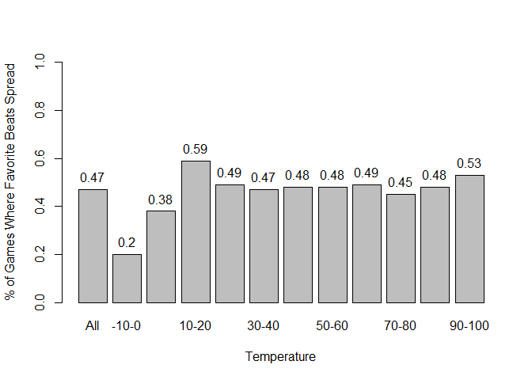

Unfortunately, the chart does not seem to shed any further light but it does visually display the association rule we see. The percentage of games in which the favorite beats the spread hovers right at or around the average of 47% for most temperature ranges from 20-90 degrees. You can see the percentages dip down to 45% in the 70-80 degree range, but it is hard to tell why this might be the case and probably requires further investigation and potentially more data.

The second rule is also less obvious, because it is saying that favorites are less likely to cover the spread of games played indoors. Below is a plot to illustrate this point.

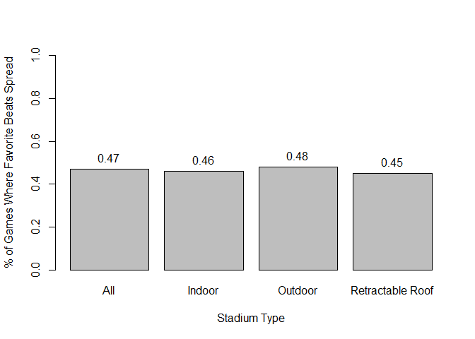

Once again, the evidence seems weak, but this could also be why the lift is barely above 1. Even though it was identifed as a rule, it is not a strong one.

The third rule is finally one that makes a lot of sense. It says that teams favored by 3 points or fewer are less likely to cover. As mentioned previously, when the predicted margin is this small, the prognosticators are essentially saying the game is close to a coin flip, so it makes sense that this uncertainty around who will win would also decrease the percentage of teams that cover. After all, you first have to win in order to also beat the spread.

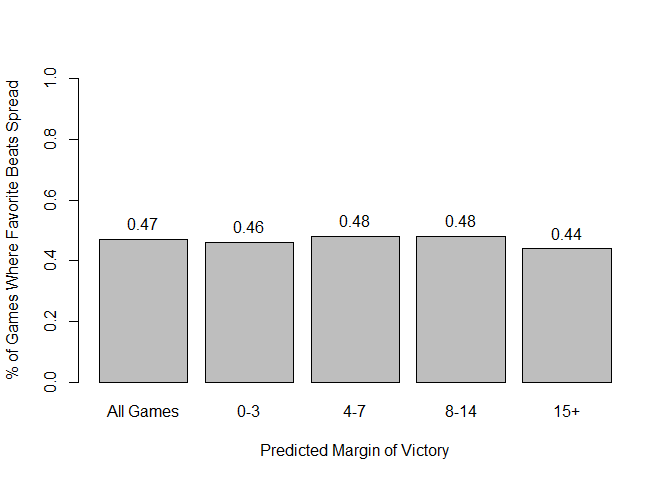

One other interesting thing you will notice from the chart, but which was not picked up in the association rules mining is that there is also a dropoff where the predicted margin of victory becomes greater than 14 (more than 2 TDs). This is also not a surprise, because even though a team might be heavily favored, it can be difficult even for good teams to beat bad teams by huge margins. If the game is not in doubt late, it is not unusual for teams to play backups or score additional points/stats in "garbage" time that do not affect the outcome of the game, but can keep point margins from being too high.

The 4th rule is also one that makes sense, because it says that when a favorite is the away team, it is also more difficult for them to cover. As established in Question 1, this is due to home-field advantage, which also has an association with the overall winner as well.

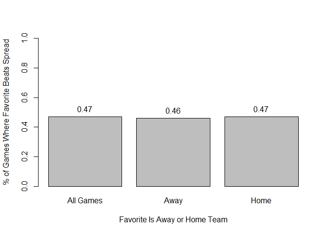

The 5th rule is a confusing one, since it is saying that there is an association between the favorite not covering the spread and the stadium surface being blank or unknown in the data. There is probably not much that can be further gleaned here, so we will just look at it visually.

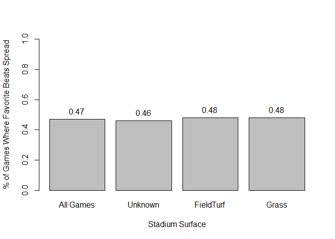

The last and final rule says that if the stadium is not at a neutral site, there is an association with the favorite not covering the spread. Going back to the idea of home-field advantage, this rule also makes sense. If it's not a neutral field, then one team is going to be at a small disadvantage just based on this fact alone. Since most NFL teams will play half their games away, the league is set up that half the time, you are working against this built in disadvantage. When the game is on a neutral field, the playing field is more "level", so you would expect the better team - as predicted - would win (and cover the predicted margin) more frequently.

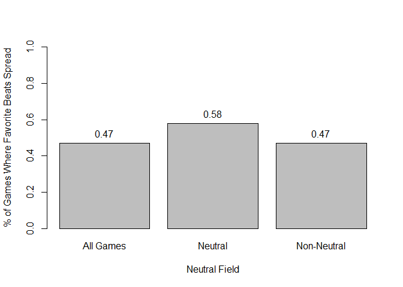

The rules in Question 2 appear to be weaker than the rules in Question 1 based on their lower supports and confidence. The frequency that the top 6 rules have ranges only from 10-25% - except for the Neutral Stadium rule, which is at 53%. On the other hand, the lift is also the lowest of the 6 for this one. On confidence, these values are also lower than in the first part. They are all still over 0.5 - meaning that the association holds true over half the time, however, none of them are over 56%. However, in gambling, just like in predicting stock movement, even an incremental increase over 50% (random guessing) can have very tangible results.

### Question 3 - Associations for Differences in Actual and Predicted Point Spreads

Now that we had taken the first two steps into this analysis, the last part of the association rules mining was to see if there were any associations with the differences in the actual and predicted point spreads. What we attempted to do here was find cases where the final margin of the game was significantly different from what was predicted (both high and low) and see if there were any associations that could be drawn in those cases. If there were insights that could be learned here, it would allow people to identify potential factors that make games very hard to predict (so they probably shouldn't even try) or find games that might be "easier" to predict, meaning their final results will end up fairly close to the pre-game predicted margin.

Similary to how we did before, we removed the favorite\_win and favorite\_beat\_spread variables since their associations are too strong with fav\_margin\_differnce and don't teach us anything. We then ran the 'apriori' algorithm after we lowered the confidence parameter to 0.5 to generate a large number of rules (1,212) to initially review.

``` r
rules.diffs <- apriori(games.differences,
                          control = list(verbose=F),
                          parameter = list(minlen=2, supp=0.1, conf=0.5)) %>% sort(by="lift")
summary(rules.diffs)
```

    ## set of 1212 rules
    ## 
    ## rule length distribution (lhs + rhs):sizes
    ##   2   3   4   5   6 
    ## 101 381 477 223  30 
    ## 
    ##    Min. 1st Qu.  Median    Mean 3rd Qu.    Max. 
    ##   2.000   3.000   4.000   3.752   4.000   6.000 
    ## 
    ## summary of quality measures:
    ##     support         confidence          lift            count     
    ##  Min.   :0.1005   Min.   :0.5027   Min.   :0.7269   Min.   : 927  
    ##  1st Qu.:0.1142   1st Qu.:0.7005   1st Qu.:0.9994   1st Qu.:1054  
    ##  Median :0.1425   Median :0.9912   Median :1.0027   Median :1315  
    ##  Mean   :0.1759   Mean   :0.8771   Mean   :1.0990   Mean   :1623  
    ##  3rd Qu.:0.1917   3rd Qu.:0.9964   3rd Qu.:1.0353   3rd Qu.:1769  
    ##  Max.   :0.9902   Max.   :1.0000   Max.   :3.6681   Max.   :9138  
    ## 
    ## mining info:
    ##               data ntransactions support confidence
    ##  games.differences          9228     0.1        0.5

``` r
inspect(rules.diffs[1:10])
```

    ##      lhs                              rhs                             support confidence     lift count
    ## [1]  {weather_temperature=(70,80],                                                                     
    ##       stadium_neutral=FALSE,                                                                           
    ##       stadium_surface=}            => {stadium_type=indoor}         0.1171435  0.7051533 3.668069  1081
    ## [2]  {weather_temperature=(70,80],                                                                     
    ##       stadium_neutral=FALSE,                                                                           
    ##       schedule_playoff=FALSE,                                                                          
    ##       stadium_surface=}            => {stadium_type=indoor}         0.1171435  0.7051533 3.668069  1081
    ## [3]  {weather_temperature=(70,80],                                                                     
    ##       stadium_surface=}            => {stadium_type=indoor}         0.1177937  0.7049287 3.666901  1087
    ## [4]  {weather_temperature=(70,80],                                                                     
    ##       schedule_playoff=FALSE,                                                                          
    ##       stadium_surface=}            => {stadium_type=indoor}         0.1177937  0.7049287 3.666901  1087
    ## [5]  {weather_temperature=(70,80],                                                                     
    ##       schedule_playoff=FALSE}      => {stadium_type=indoor}         0.1903988  0.5695300 2.962583  1757
    ## [6]  {home_team_favorite=Yes,                                                                          
    ##       stadium_type=indoor}         => {weather_temperature=(70,80]} 0.1224534  0.9973522 2.960298  1130
    ## [7]  {stadium_neutral=FALSE,                                                                           
    ##       home_team_favorite=Yes,                                                                          
    ##       stadium_type=indoor}         => {weather_temperature=(70,80]} 0.1216948  0.9973357 2.960249  1123
    ## [8]  {schedule_playoff=FALSE,                                                                          
    ##       home_team_favorite=Yes,                                                                          
    ##       stadium_type=indoor}         => {weather_temperature=(70,80]} 0.1212614  0.9973262 2.960221  1119
    ## [9]  {stadium_neutral=FALSE,                                                                           
    ##       schedule_playoff=FALSE,                                                                          
    ##       home_team_favorite=Yes,                                                                          
    ##       stadium_type=indoor}         => {weather_temperature=(70,80]} 0.1208279  0.9973166 2.960192  1115
    ## [10] {stadium_type=indoor}         => {weather_temperature=(70,80]} 0.1916992  0.9971815 2.959791  1769

Once again, we narrowed down our list of rules to only rules with associations to the point margin diferences between the actual and predicted margins by the favorites.

``` r
rules.diffs <- apriori(games.differences,
                            control = list(verbose=F),
                            parameter = list(minlen=2, supp=0.001, conf=0.5),
                      appearance = list(rhs=c("fav_margin_difference=(-56,-49]", "fav_margin_difference=(-49,-42]", "fav_margin_difference=(-42,-35]", "fav_margin_difference=(-35,-28]", "fav_margin_difference=(-28,-21]", "fav_margin_difference=(-21,-14]", "fav_margin_difference=(-14,-7]", "fav_margin_difference=(-7,0]", "fav_margin_difference=(0,7]", "fav_margin_difference=(7,14]", "fav_margin_difference=(14,21]", "fav_margin_difference=(21,28]", "fav_margin_difference=(28,35]", "fav_margin_difference=(35,42]", "fav_margin_difference=(42,49]", "fav_margin_difference=(49,56]"),
                                   default="lhs")) %>% sort(by="lift")
summary(rules.diffs)
```

    ## set of 1489 rules
    ## 
    ## rule length distribution (lhs + rhs):sizes
    ##   3   4   5   6   7   8   9  10 
    ##   7  65 241 431 421 235  76  13 
    ## 
    ##    Min. 1st Qu.  Median    Mean 3rd Qu.    Max. 
    ##   3.000   6.000   7.000   6.523   7.000  10.000 
    ## 
    ## summary of quality measures:
    ##     support           confidence          lift           count      
    ##  Min.   :0.001084   Min.   :0.5000   Min.   :2.162   Min.   :10.00  
    ##  1st Qu.:0.001084   1st Qu.:0.5217   1st Qu.:2.276   1st Qu.:10.00  
    ##  Median :0.001084   Median :0.5556   Median :2.544   Median :10.00  
    ##  Mean   :0.001169   Mean   :0.5760   Mean   :2.639   Mean   :10.79  
    ##  3rd Qu.:0.001192   3rd Qu.:0.5909   3rd Qu.:2.967   3rd Qu.:11.00  
    ##  Max.   :0.002059   Max.   :0.7692   Max.   :4.185   Max.   :19.00  
    ## 
    ## mining info:
    ##               data ntransactions support confidence
    ##  games.differences          9228   0.001        0.5

``` r
inspect(rules.diffs[1:5])
```

    ##     lhs                               rhs                                  support confidence     lift count
    ## [1] {weather_temperature=(50,60],                                                                           
    ##      fav_margin_predicted=(14,27],                                                                          
    ##      stadium_surface=Grass}        => {fav_margin_difference=(-14,-7]} 0.001083658  0.6666667 4.185034    10
    ## [2] {weather_temperature=(50,60],                                                                           
    ##      schedule_playoff=FALSE,                                                                                
    ##      fav_margin_predicted=(14,27],                                                                          
    ##      stadium_surface=Grass}        => {fav_margin_difference=(-14,-7]} 0.001083658  0.6666667 4.185034    10
    ## [3] {weather_temperature=(50,60],                                                                           
    ##      stadium_neutral=FALSE,                                                                                 
    ##      fav_margin_predicted=(14,27],                                                                          
    ##      stadium_surface=Grass}        => {fav_margin_difference=(-14,-7]} 0.001083658  0.6666667 4.185034    10
    ## [4] {weather_temperature=(50,60],                                                                           
    ##      stadium_neutral=FALSE,                                                                                 
    ##      schedule_playoff=FALSE,                                                                                
    ##      fav_margin_predicted=(14,27],                                                                          
    ##      stadium_surface=Grass}        => {fav_margin_difference=(-14,-7]} 0.001083658  0.6666667 4.185034    10
    ## [5] {schedule_season=1990,                                                                                  
    ##      weather_temperature=(50,60],                                                                           
    ##      points_scored=(28,42]}        => {fav_margin_difference=(7,14]}   0.001083658  0.5000000 3.806931    10

One thing we quickly saw was that we had to lower our parameters even further to get any rules returned. We kept the confidence at a minimum of 0.5, because we wanted to make sure that the associations were true at least half the time - which is the meaning behind the value of 0.5 However, we lowered support all the way to 0.001. Support indicates how often the rule appears in the dataset, so by reducing this value, we reduced the minimum number of times it had to appear and would be careful on how we interpreted it. However, at least this gave us some results that we could review. Once we removed redundant rules, we were down to 113 rules.

``` r
subset.matrix <- is.subset(rules.diffs, rules.diffs)
redundant <- colSums(subset.matrix) > 1
rules.diffs.reduced <- rules.diffs[!redundant] 
summary(rules.diffs.reduced)
```

    ## set of 113 rules
    ## 
    ## rule length distribution (lhs + rhs):sizes
    ##  3  4  5  6 
    ##  7 38 54 14 
    ## 
    ##    Min. 1st Qu.  Median    Mean 3rd Qu.    Max. 
    ##   3.000   4.000   5.000   4.664   5.000   6.000 
    ## 
    ## summary of quality measures:
    ##     support           confidence          lift           count      
    ##  Min.   :0.001084   Min.   :0.5000   Min.   :2.162   Min.   :10.00  
    ##  1st Qu.:0.001084   1st Qu.:0.5000   1st Qu.:2.162   1st Qu.:10.00  
    ##  Median :0.001192   Median :0.5238   Median :2.378   Median :11.00  
    ##  Mean   :0.001217   Mean   :0.5360   Mean   :2.493   Mean   :11.23  
    ##  3rd Qu.:0.001300   3rd Qu.:0.5500   3rd Qu.:2.652   3rd Qu.:12.00  
    ##  Max.   :0.002059   Max.   :0.7333   Max.   :4.185   Max.   :19.00  
    ## 
    ## mining info:
    ##               data ntransactions support confidence
    ##  games.differences          9228   0.001        0.5

``` r
inspect(rules.diffs.reduced[1:5])
```

    ##     lhs                               rhs                                  support confidence     lift count
    ## [1] {weather_temperature=(50,60],                                                                           
    ##      fav_margin_predicted=(14,27],                                                                          
    ##      stadium_surface=Grass}        => {fav_margin_difference=(-14,-7]} 0.001083658  0.6666667 4.185034    10
    ## [2] {schedule_season=1990,                                                                                  
    ##      weather_temperature=(50,60],                                                                           
    ##      points_scored=(28,42]}        => {fav_margin_difference=(7,14]}   0.001083658  0.5000000 3.806931    10
    ## [3] {team_favorite_id=BUF,                                                                                  
    ##      weather_temperature=(30,40],                                                                           
    ##      points_scored=(28,42]}        => {fav_margin_difference=(0,7]}    0.001083658  0.6666667 3.374657    10
    ## [4] {weather_wind_mph=(0,10],                                                                               
    ##      team_underdog_id=JAX,                                                                                  
    ##      stadium_surface=FieldTurf}    => {fav_margin_difference=(-7,0]}   0.001192024  0.7333333 3.171134    11
    ## [5] {stadium_surface=FieldTurf,                                                                             
    ##      points_scored=(0,14]}         => {fav_margin_difference=(-14,-7]} 0.001083658  0.5000000 3.138776    10

If you look at the top 5, you can quickly see that even though the lift numbers are very high (and the confidence too in many cases), the support/number of times it appears in the dataset is very low. In the top 5 rules, all of them appear only 10 or 11 times (0.1% of the time). This could very well indicate this rule is really just noise and there would be concern in extrapolating these results over a broader population.

The conclusion from this analysis is that this dataset contains enough variables to draw some solid associations between higher level questions, such as whether the favored team wins or not, or even if they cover the spread. However, the strength of the rules breaks down when you go deeper into trying to determine associations between the differences in actual and predicted point margins.

In some instances, these insights might be helpful, but to draw any deeper conclusions, more granular data would be needed - if it even exists. After all, if it was that easy to predict point margins between pre-game spreads and the actual final scores, places like Las Vegas would not stay in business for very long!
