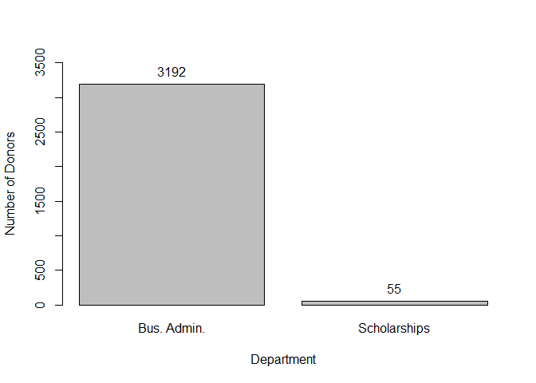

Market Basket Analysis Using Association Rule Mining for Donations
================

Introduction
------------

This analysis looked at a dataset of donations made by a group of individuals to a higher education institution during the 2018 fiscal year. We wanted to do a market basket analysis using association rule mining to determine if there were certain areas of the university a donor was more likely to make a gift to based on other area(s) to which they might have given during the same fiscal year.

Identifying these trends can be very useful to higher education fundraisers. As development becomes increasingly important to schools to fund their annual budgets, discovering these trends can help staff target their constituents much more effectively with solicitations to the areas in which they would be most likely to give.

The Data
--------

The dataset consisted of 8,529 unique rows of giving information and basic demographic/biographic details for each individual who made a gift to the College of Business in Fiscal Year 2018. There were 4,579 unique donors in the dataset, because donors would have multiple rows if they gave to multiple departments in the same fiscal year. The 8 variables included were:

ID\_NUMBER - unique ID number for each donor

GIFT\_DEPARTMENT - department to which a gift was made

GIFT\_SCHOOL - college/area to which a gift was made

AGE

GENDER - F (Female) / M (Male) / U (Unknown)

MARITAL\_STATUS - F (Formerly married) / M (Married) / P (Domestic Partner) / S (Single) / U (Unknown) / W (Widowed) / Z (Deceased Spouse)

GRADUATION\_YR

MAJOR - 4-digit code for major

Approach
--------

Our approach to this problem was broken down into two steps:

1.  Use association rule mining to determine relationships with giving between the College of Business and other departments

2.  Identify the other department contained in the top association rule - by lift - and build a model on the demographic characteristics of the donors to predict the donors who would be most likely to give to both

### Cleaning & Formatting the Data

Before assocation rule mining could begin, several steps needed to be taken to clean and format the data to get it into the proper format for analysis. Here is a brief look at the original data, along with the data types for each variable:

    ## 'data.frame':    8529 obs. of  8 variables:
    ##  $ ID_NUMBER      : int  4348 4038 4348 4348 4082 4494 4104 4362 4496 4104 ...
    ##  $ GIFT_DEPARTMENT: Factor w/ 200 levels "Academic Affairs Admin-UTM",..: 190 31 190 31 31 176 101 100 101 31 ...
    ##  $ GIFT_SCHOOL    : Factor w/ 57 levels "AGR-Ag Extension Service",..: 25 36 25 36 36 36 36 36 36 36 ...
    ##  $ AGE            : int  20 20 20 20 21 21 21 21 21 21 ...
    ##  $ GENDER         : chr  "M" "F" "M" "M" ...
    ##  $ MARITAL_STATUS : chr  "U" "U" "U" "U" ...
    ##  $ GRADUATION_YR  : int  NA 2018 NA NA 2017 NA NA NA 2018 NA ...
    ##  $ MAJOR          : Factor w/ 197 levels ""," ","C100",..: 1 45 1 1 176 1 1 1 122 1 ...

The first thing we did was narrow down the dataset to just the columns we needed to convert this data frame to a Transactions object so that we could run the 'arules' algorithm on it. The only two columns we needed for that were ID\_NUMBER and GIFT\_DEPARTMENT. After some thought, it was determined this was the best level to do the assocation rule mining. Since all of the donors in this file had made a gift to the College of Business - which would have been contained at the GIFT\_SCHOOL level - any results we tried to find using GIFT\_SCHOOL would have very limited usefulness. That's because the confidence for all of the generated rules for gifts to the College of Business would have been 1, since everyone in the file had done this.

We then needed to remove duplicate rows, since people could have given to different departments under the same school. These rows would have been unique in the original file but no longer in the smaller file. After removing duplicates, we were then left with 7,461 rows. From there, we could then take the final step of coverting the data to the Transactions object.

    ## transactions in sparse format with
    ##  4579 transactions (rows) and
    ##  200 items (columns)

Part 1 - Association Rule Mining
--------------------------------

At this point, we were ready to rule the 'arules' algorithm on the transactions dataset. We lowered the support paramter to 0.005 and the confidence parameter to 0.6 in order to generate a broader set of rules.

``` r
donation_rules_dept <- apriori(donations.dept.trans, 
                                  parameter = list(sup = 0.005, conf = 0.6, minlen=2)) %>% sort(by="lift")
```

    ## Apriori
    ## 
    ## Parameter specification:
    ##  confidence minval smax arem  aval originalSupport maxtime support minlen
    ##         0.6    0.1    1 none FALSE            TRUE       5   0.005      2
    ##  maxlen target   ext
    ##      10  rules FALSE
    ## 
    ## Algorithmic control:
    ##  filter tree heap memopt load sort verbose
    ##     0.1 TRUE TRUE  FALSE TRUE    2    TRUE
    ## 
    ## Absolute minimum support count: 22 
    ## 
    ## set item appearances ...[0 item(s)] done [0.00s].
    ## set transactions ...[200 item(s), 4579 transaction(s)] done [0.00s].
    ## sorting and recoding items ... [32 item(s)] done [0.00s].
    ## creating transaction tree ... done [0.00s].
    ## checking subsets of size 1 2 3 done [0.00s].
    ## writing ... [33 rule(s)] done [0.00s].
    ## creating S4 object  ... done [0.00s].

``` r
summary(donation_rules_dept)
```

    ## set of 33 rules
    ## 
    ## rule length distribution (lhs + rhs):sizes
    ##  2  3 
    ## 22 11 
    ## 
    ##    Min. 1st Qu.  Median    Mean 3rd Qu.    Max. 
    ##   2.000   2.000   2.000   2.333   3.000   3.000 
    ## 
    ## summary of quality measures:
    ##     support           confidence          lift           count      
    ##  Min.   :0.005023   Min.   :0.6000   Min.   :1.001   Min.   : 23.0  
    ##  1st Qu.:0.006115   1st Qu.:0.7692   1st Qu.:1.181   1st Qu.: 28.0  
    ##  Median :0.008736   Median :0.8409   Median :1.268   Median : 40.0  
    ##  Mean   :0.012819   Mean   :0.8226   Mean   :1.959   Mean   : 58.7  
    ##  3rd Qu.:0.011356   3rd Qu.:0.8909   3rd Qu.:1.352   3rd Qu.: 52.0  
    ##  Max.   :0.107010   Max.   :0.9688   Max.   :6.515   Max.   :490.0  
    ## 
    ## mining info:
    ##                  data ntransactions support confidence
    ##  donations.dept.trans          4579   0.005        0.6

``` r
inspect(donation_rules_dept[1:10])
```

    ##      lhs                                      rhs                                       support confidence     lift count
    ## [1]  {Business Administration - Admin-UTK,                                                                               
    ##       Women's Basketball-UTK}              => {Athletic Dept Administration-UTK}    0.010701026  0.8750000 6.514837    49
    ## [2]  {Women's Basketball-UTK}              => {Athletic Dept Administration-UTK}    0.011356191  0.8387097 6.244637    52
    ## [3]  {Business Administration - Admin-UTK,                                                                               
    ##       MBA Program-Full Time-UTK}           => {Athletic Dept Administration-UTK}    0.005022931  0.6764706 5.036681    23
    ## [4]  {Business Administration - Admin-UTK,                                                                               
    ##       Program Support-McClung-UTK}         => {Athletic Dept Administration-UTK}    0.005241319  0.6486486 4.829532    24
    ## [5]  {Program Support-McClung-UTK}         => {Athletic Dept Administration-UTK}    0.006114872  0.6363636 4.738064    28
    ## [6]  {Business Administration - Admin-UTK,                                                                               
    ##       Law}                                 => {Athletic Dept Administration-UTK}    0.005896484  0.6000000 4.467317    27
    ## [7]  {Athletic Dept Administration-UTK,                                                                                  
    ##       Office of Chancellor-UTK}            => {Business Administration - Admin-UTK} 0.006770037  0.9687500 1.389695    31
    ## [8]  {Scholarships-UTK}                    => {Business Administration - Admin-UTK} 0.011356191  0.9454545 1.356277    52
    ## [9]  {Athletic Dept Administration-UTK,                                                                                  
    ##       Women's Basketball-UTK}              => {Business Administration - Admin-UTK} 0.010701026  0.9423077 1.351763    49
    ## [10] {Athletic Dept Administration-UTK,                                                                                  
    ##       Law}                                 => {Business Administration - Admin-UTK} 0.005896484  0.9310345 1.335591    27

This run generated a set of 33 rules, but with a quick review of the Top 10 (by lift), we could see that there were some redundant rules we needed to address. After we did, we were then left with 22 rules and looked at the top 10 in greater detail.

``` r
subset.matrix <- is.subset(donation_rules_dept, donation_rules_dept)
redundant <- colSums(subset.matrix) > 1
donation.rules.dept.reduced <- donation_rules_dept[!redundant] 
summary(donation.rules.dept.reduced)
```

    ## set of 22 rules
    ## 
    ## rule length distribution (lhs + rhs):sizes
    ##  2 
    ## 22 
    ## 
    ##    Min. 1st Qu.  Median    Mean 3rd Qu.    Max. 
    ##       2       2       2       2       2       2 
    ## 
    ## summary of quality measures:
    ##     support           confidence          lift           count       
    ##  Min.   :0.005678   Min.   :0.6364   Min.   :1.001   Min.   : 26.00  
    ##  1st Qu.:0.006770   1st Qu.:0.7778   1st Qu.:1.146   1st Qu.: 31.00  
    ##  Median :0.010264   Median :0.8360   Median :1.221   Median : 47.00  
    ##  Mean   :0.015724   Mean   :0.8249   Mean   :1.586   Mean   : 72.00  
    ##  3rd Qu.:0.013922   3rd Qu.:0.8824   3rd Qu.:1.284   3rd Qu.: 63.75  
    ##  Max.   :0.107010   Max.   :0.9455   Max.   :6.245   Max.   :490.00  
    ## 
    ## mining info:
    ##                  data ntransactions support confidence
    ##  donations.dept.trans          4579   0.005        0.6

``` r
inspect(donation.rules.dept.reduced[1:10])
```

    ##      lhs                                     rhs                                       support confidence     lift count
    ## [1]  {Women's Basketball-UTK}             => {Athletic Dept Administration-UTK}    0.011356191  0.8387097 6.244637    52
    ## [2]  {Program Support-McClung-UTK}        => {Athletic Dept Administration-UTK}    0.006114872  0.6363636 4.738064    28
    ## [3]  {Scholarships-UTK}                   => {Business Administration - Admin-UTK} 0.011356191  0.9454545 1.356277    52
    ## [4]  {Educ, Health & Human Svs-Admin-UTK} => {Business Administration - Admin-UTK} 0.016160734  0.9135802 1.310553    74
    ## [5]  {Women's Basketball-UTK}             => {Business Administration - Admin-UTK} 0.012229744  0.9032258 1.295699    56
    ## [6]  {General Administration-UWA}         => {Business Administration - Admin-UTK} 0.005678096  0.8965517 1.286125    26
    ## [7]  {Arts and Sciences Admin-UTK}        => {Business Administration - Admin-UTK} 0.010701026  0.8909091 1.278030    49
    ## [8]  {Libraries-UTK}                      => {Business Administration - Admin-UTK} 0.008298755  0.8837209 1.267719    38
    ## [9]  {Engineering Administration - UTK}   => {Business Administration - Admin-UTK} 0.014195239  0.8783784 1.260055    65
    ## [10] {Office of Chancellor-UTK}           => {Business Administration - Admin-UTK} 0.016379122  0.8620690 1.236658    75

The top 2 rules involved associations with departments that were not related to the College of Business, so we skipped down to \#3 to find the first one that did. From there, 3-10 all had associations between giving to the Department of Business Administration and other departments to the university. The top 5 by lift were:

1.  Scholarships - Campus Wide
2.  College of Education
3.  Women's Basketball
4.  General Administration - System Wide
5.  College of Arts & Sciences

Part 2 - Predictive Modeling
----------------------------

Once we determined what the top association rules were for giving to other departments with giving to the College of Business, we turned our attention to building a predictive model. This would allow us to better determine which characteristics from the demo/bio data could help predict the profile of people who might be the best prospects to give to two areas. For our analysis, we decided to pick the top rule - giving to Scholarships. So more specifically, the question became: What types of donors are most likely to make gifts to both the Department of Business Administration and to Scholarships?



When we looked at the data, we saw that while 3,192 donors made a gift to the Department of Business Administration in FY18, only 55 donors made a gift to Scholarships. However, of these 55, 52 of them also made a gift to the Department of Business Administration. Therefore, we could better identify the best prospects who would give to both areas since there was a strong association between giving to Scholarships and Business Administration.

The first step we took to start this part of the analysis was to identify which 52 people had made a gift to both areas to use as our target group.

Once we did that, we went back to our original dataframe with demo/bio data and combined those characteristics with our target variables. Then, we narrowed down the entire group of 4,579 donors to only the 3,192 donors who had made a gift to the Department of Business Administration. Here is a short outline of what this new dataset looked like:

``` r
str(donations.target)
```

    ## 'data.frame':    3192 obs. of  7 variables:
    ##  $ ID_NUMBER     : int  1 5 6 7 8 9 10 11 13 14 ...
    ##  $ AGE           : int  NA NA NA NA NA NA NA NA NA NA ...
    ##  $ GENDER        : chr  "U" "U" "U" "U" ...
    ##  $ MARITAL_STATUS: chr  "U" "U" "U" "U" ...
    ##  $ GRADUATION_YR : int  NA NA NA NA NA NA NA NA NA NA ...
    ##  $ MAJOR         : Factor w/ 197 levels ""," ","C100",..: 1 1 1 1 1 1 1 1 1 1 ...
    ##  $ TARGET        : num  0 0 0 0 0 0 0 0 0 0 ...

For our predictive model, we decided to use LASSO (Least Absolute Shrinkage and Selection Operator), which required us to clean our data to get all the variables into a numeric format and also handle missing values. To do this, we created binary/dummy variables for each of the GENDER, MARITAL\_STATUS, and MAJOR categories. We also binned the AGE and GRADUATION\_YR categories into dummy variables by decade, which accomplished two things for us. First, it allowed us to account for potential non-linearity in relationships of these variables with the target variable. For example, in giving, sometimes the likelihood of someone making a gift increases until they hit their 60s-70s and then starts to decrease again. This method also allowed us to handle the missing values that were present in both of these categories.

Once all these steps were done, we were left with a much larger dataset that contained many dummy variables for the converted categorical variables, but which was now formatted for us to be able to run LASSO.

``` r
table(donations.target$TARGET)
```

    ## 
    ##    0    1 
    ## 3140   52

Our data was very unbalanced as illustrated by the breakdown above (0 - did not give to Scholarships; 1 - did give to Scholarships), since only 1.6% fit into our target group. Therefore, we decided to address this discrepancy by upsampling our data to achieve the new breakdown below:

    ## 
    ##    0    1 
    ## 3140 3140

We then proceeded to divide our data into training, validation, and testing sets.

``` r
ind <- sample(x=1:nrow(donations.target2),size=nrow(donations.target2))
train <- ind[1:round(length(donations.target2$TARGET)*0.4)]
val <- ind[(round(length(donations.target2$TARGET)*0.4)+1):(round(length(donations.target2$TARGET)*0.8))]
test <- ind[((round(length(donations.target2$TARGET)*0.8))+1):length(donations.target2$TARGET)]
finaltrain <- c(train, val)
donations.targetTRAIN <- donations.target2[train,]
donations.targetVAL <- donations.target2[val,]
donations.targetFINALTRAIN <- donations.target2[finaltrain,]
donations.targetTEST <- donations.target2[test,]
```

We used a random 40% of the data to intially train the model.

``` r
glmnet_model <- glmnet(x = data.matrix(donations.targetTRAIN[,c(2:(ncol(donations.targetTRAIN)-1))]),
                       y = donations.targetTRAIN$TARGET,
                       family = 'binomial')
```

Then, we used another random 40% for validation by solving for the optimal value of lambda, using AUC as a measure.

``` r
aucstore <- numeric(length(glmnet_model$lambda))
for(j in 1:length(glmnet_model$lambda)) {
  glmnet_pred <- predict(glmnet_model,
                         newx = data.matrix(donations.targetVAL[,c(2:(ncol(donations.targetVAL)-1))]),
                         type = 'response',
                         s = glmnet_model$lambda[j])
  aucstore[j] <- AUC::auc(roc(as.numeric(glmnet_pred), as.factor(donations.targetVAL$TARGET)))
}
glmnet.lambda <- glmnet_model$lambda[which.max(aucstore)]
```

Once this was done, we combined the training and validation sets to train the model again, using the optimal value of lambda found in the previous step.

``` r
glmnet_model <- glmnet(x = data.matrix(donations.targetFINALTRAIN[,c(2:(ncol(donations.targetFINALTRAIN)-1))]),
                       y = donations.targetFINALTRAIN$TARGET,
                       family = 'binomial')
```

Finally, we tested this model on the 20% testing set to see how well it performed.

``` r
glmnet_pred <- predict(glmnet_model,
                       newx = data.matrix(donations.targetTEST[,c(2:(ncol(donations.targetTEST)-1))]),
                       type = 'response',
                       s = glmnet.lambda)
AUC::auc(roc(glmnet_pred, as.factor(donations.targetTEST$TARGET)))
```

    ## [1] 0.8127633

``` r
plot(roc(glmnet_pred, as.factor(donations.targetTEST$TARGET)))
```


Using this approach, we obtained an AUC of 0.8, which is significantly better than random (0.5). This result is very promising to suggest this model could be useful in better identifying prospects who would give to both Business Administration and Scholarships.

This analysis has very practical results and could be improved with additional data fields on donors. While we just looked at Age, Gender, Marital Status, Graduation Year, and Major, many schools have dozens (if not hundreds) more variables they collect on their alumni and donors that could provide better predictions around giving. Also, while we just looked at the top association of Business Administration and Scholarships, this same approach could be used for any type of giving combinations to different areas of the university.
